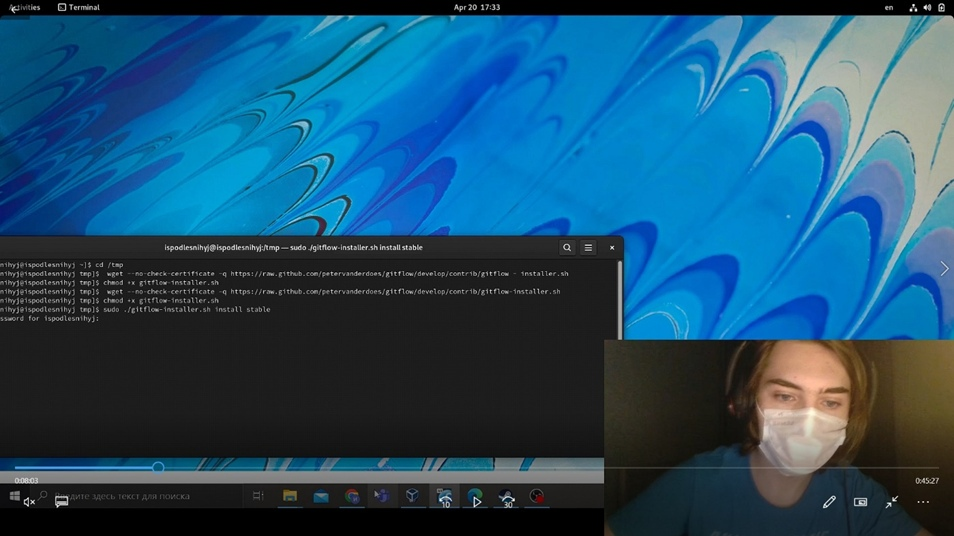
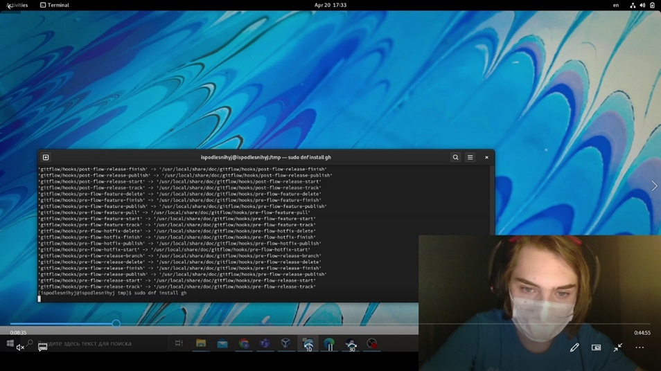
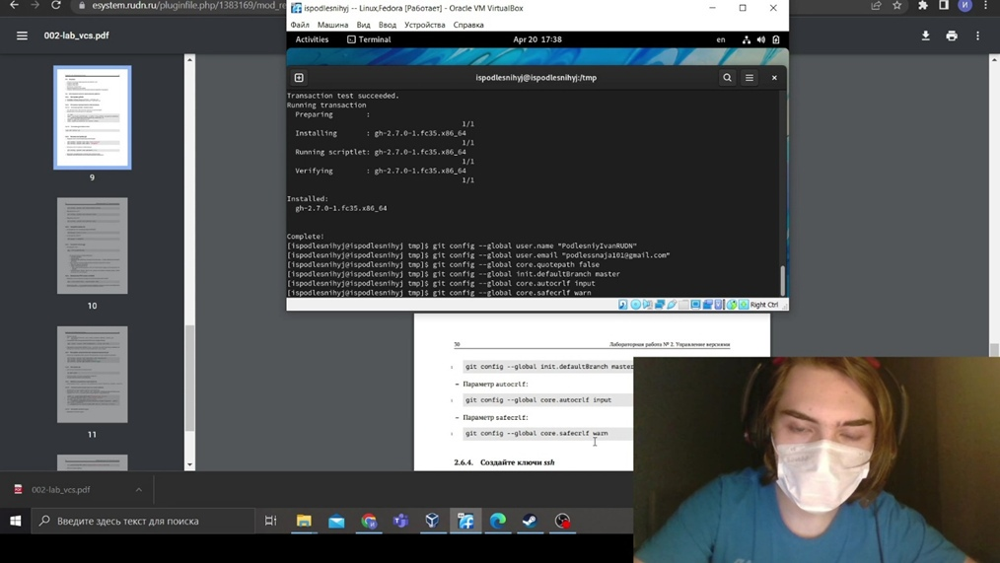
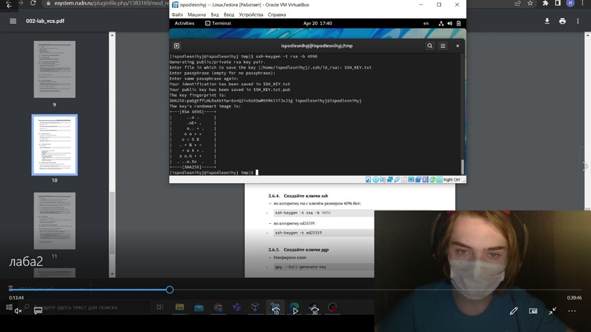
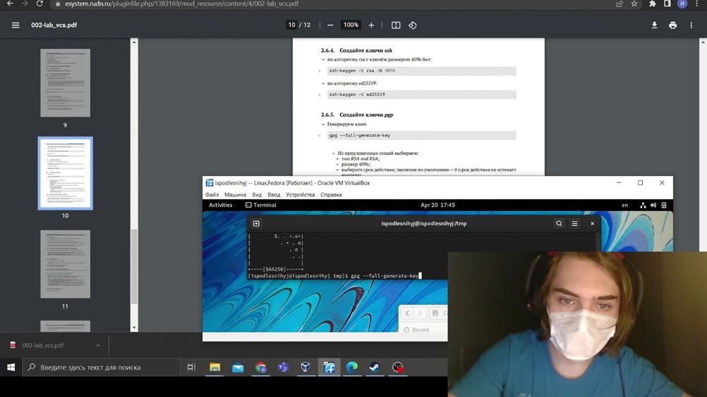
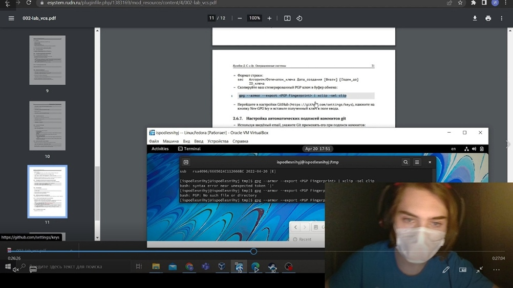
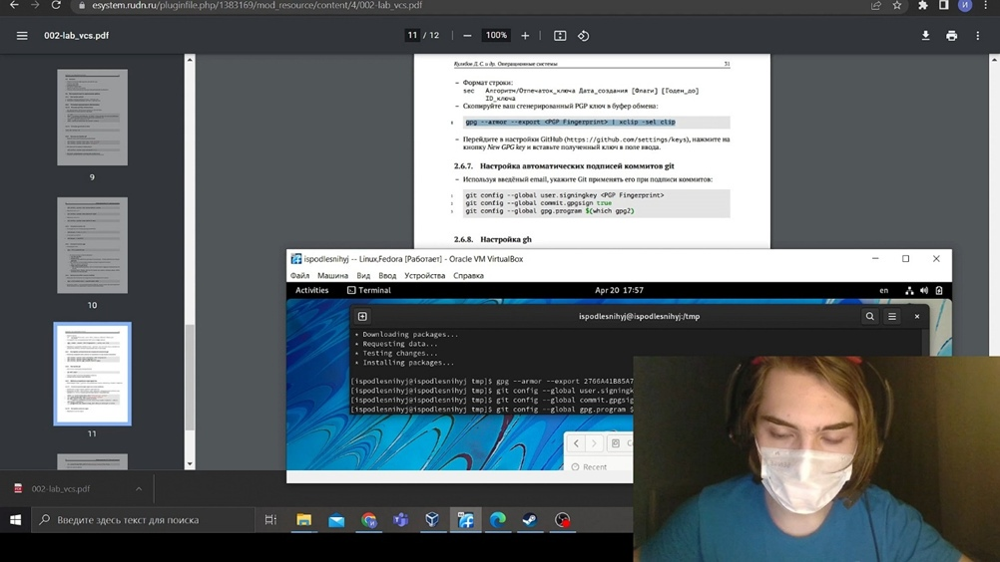
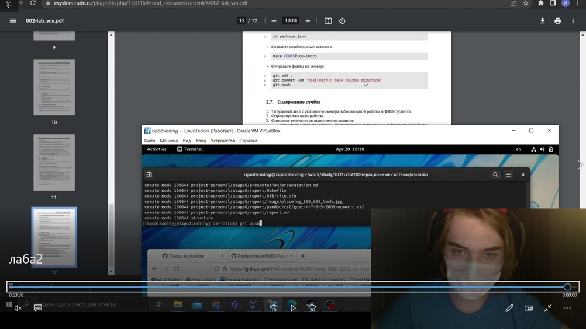
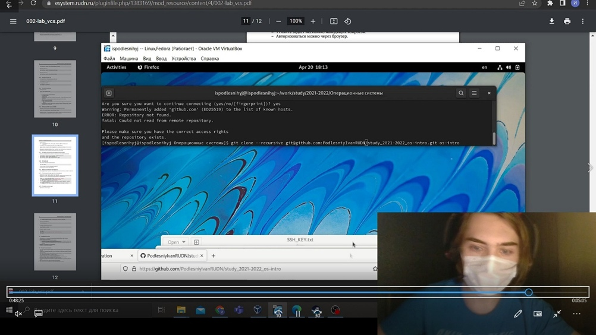

                            РОССИЙСКИЙ УНИВЕРСИТЕТ ДРУЖБЫ НАРОДОВ 

                      факультет физико-математических и естественных наук

                                            ОТЧЕТ ПО ЛАБОРАТОРНОЙ РАБОТЕ № 2
                                            дисциплина: Операционные системы
                                            Студент: Подлесный Иван Сергеевич
                                                  Группа: НКНбд-01-21

                                         МОСКВА
                                          2022 г.

>## ЦЕЛЬ РАБОТЫ

>**Изучить идеологию и применение средств контроля версий. Освоить умения по работе с git.**

## Ход работы

1. Устанавливаем git-flow в Fedora Linux. Это программное
 обеспечение удалено из репозитория. – Необходимо устанавливать его вручную:
 

2. Установка gh в Fedora Linux:
 
3. Базовая настройка git:

4. Создание ключей ssh:

5. Создание GPG ключей:
  
6. .Добавление GPG ключей в git:

7. Настройка автоматических подписей коммитов git:
 
8. Настройка gh:

9. Создание репозитория на основе курса
 
10. Настройка каталога курса
 

## ВЫВОДЫ

>**Мы изучили идеологию и применение средств контроля версий. Освоили умения по работе с git.**
