---
## Front matter
title: "Отчёт по лабораторной работе №4"
subtitle: "НКНбд-01-21"
author: "Подлесный Иван Сергеевич"

## Generic otions
lang: ru-RU
toc-title: "Содержание"

## Bibliography
bibliography: bib/cite.bib
csl: pandoc/csl/gost-r-7-0-5-2008-numeric.csl

## Pdf output format
toc: true # Table of contents
toc-depth: 2
fontsize: 12pt
linestretch: 1.5
papersize: a4
documentclass: scrreprt
## I18n polyglossia
polyglossia-lang:
  name: russian
  options:
	- spelling=modern
	- babelshorthands=true
polyglossia-otherlangs:
  name: english
## I18n babel
babel-lang: russian
babel-otherlangs: english
## Fonts
mainfont: PT Serif
romanfont: PT Serif
sansfont: PT Sans
monofont: PT Mono
mainfontoptions: Ligatures=TeX
romanfontoptions: Ligatures=TeX
sansfontoptions: Ligatures=TeX,Scale=MatchLowercase
monofontoptions: Scale=MatchLowercase,Scale=0.9
## Biblatex
biblatex: true
biblio-style: "gost-numeric"
biblatexoptions:
  - parentracker=true
  - backend=biber
  - hyperref=auto
  - language=auto
  - autolang=other*
  - citestyle=gost-numeric
## Pandoc-crossref LaTeX customization
figureTitle: "Рис."
tableTitle: "Таблица"
listingTitle: "Листинг"
lofTitle: "Цель Работы"
lotTitle: "Ход Работы"
lolTitle: "Листинги"
## Misc options
indent: true
header-includes:
  - \usepackage{indentfirst}
  - \usepackage{float} # keep figures where there are in the text
  - \floatplacement{figure}{H} # keep figures where there are in the text
---

># ЦЕЛЬ РАБОТЫ

>**Приобретение практических навыков взаимодействия пользователя с системой посредством командной строки.**

# Ход работы

1. . Определите полное имя вашего домашнего каталога. Далее относительно этого каталога будут выполняться последующие упражнения.

 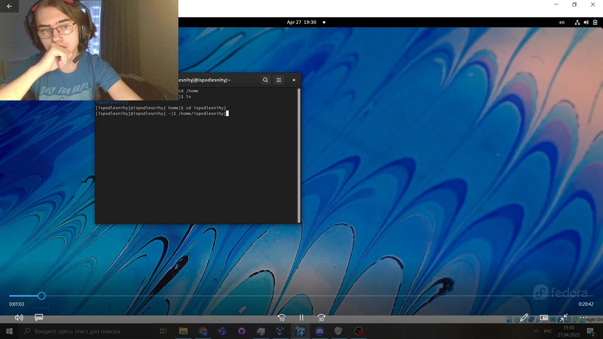  

2. Выполните следующие действия:
   
      - Перейдите в каталог /tmp и выведите на экран содержимое каталога /tmp. Для этого используйте команду ls
      с различными опциями. Поясните разницу в выводимой на экран информации. :
   
      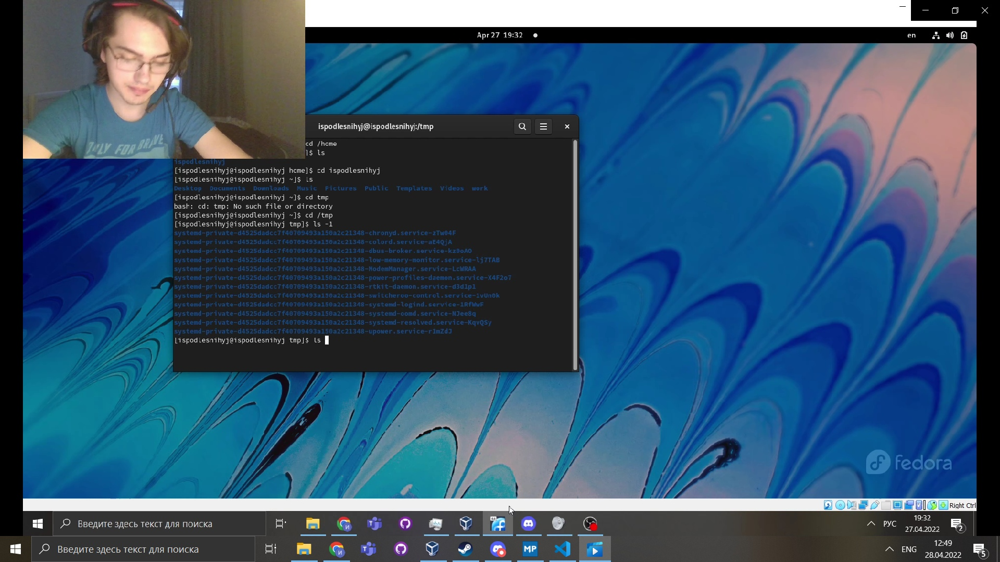

     - Определите, есть ли в каталоге /var/spool подкаталог с именем cron?
  
       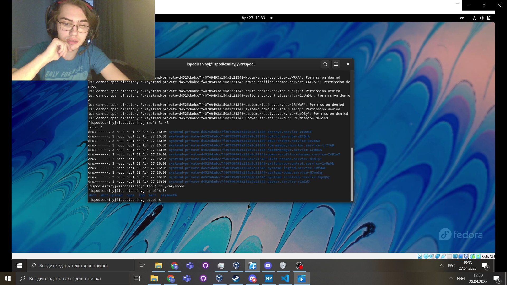

     - Перейдите в Ваш домашний каталог и выведите на экран его содержимое. Определите, кто является владельцем файлов и подкаталогов:
  
      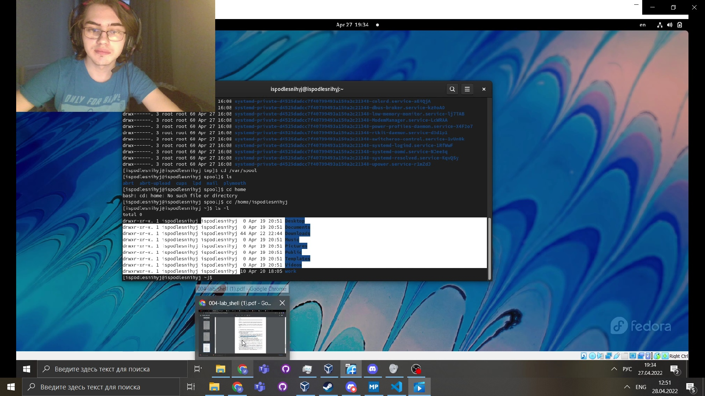

3. Выполните следующие действия:
   
         В домашнем каталоге создайте новый каталог с именем newdir. :
   
      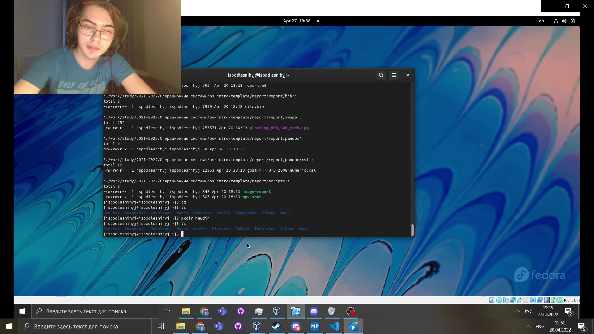

     - В каталоге ~/newdir создайте новый каталог с именем morefun.?
  
       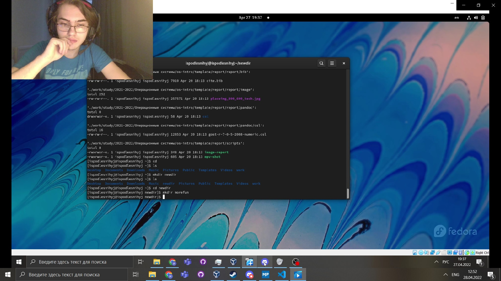

     - В домашнем каталоге создайте одной командой три новых каталога с letters, memos, misk. Затем удалите эти каталоги одной командой:
      
      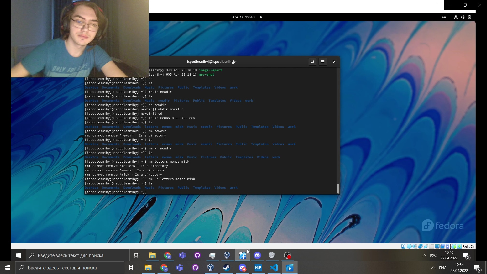

     - Попробуйте удалить ранее созданный каталог ~/newdir командой rm. Удалён ли каталог:
      
      

     - Удалите каталог ~/newdir/morefun из домашнего каталога. Проверьте его удалёние:
      
      

4. С помощью команды man определите, какую опцию команды ls нужно использовать для просмотра содержимое не только указанного каталога, но и подкаталогов,
входящих в него.

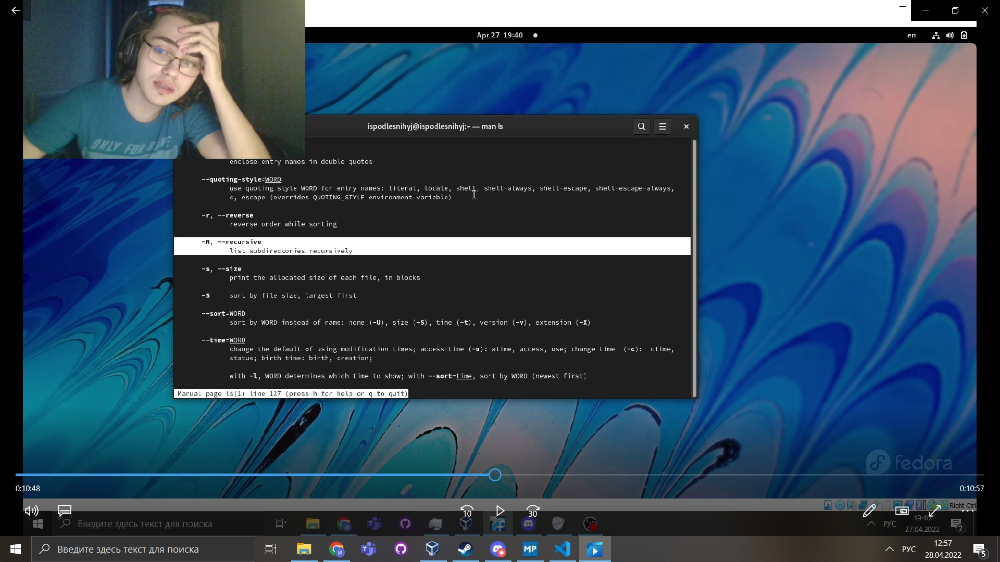

5. С помощью команды man определите набор опций команды ls, позволяющий отсортировать по времени последнего изменения выводимый список содержимого каталога
с развёрнутым описанием файлов.

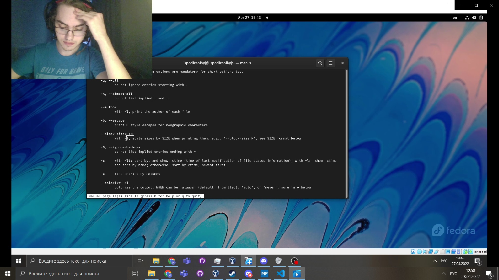

6. Используйте команду man для просмотра описания следующих команд: cd, pwd, mkdir,
rmdir, rm. Поясните основные опции этих команд.

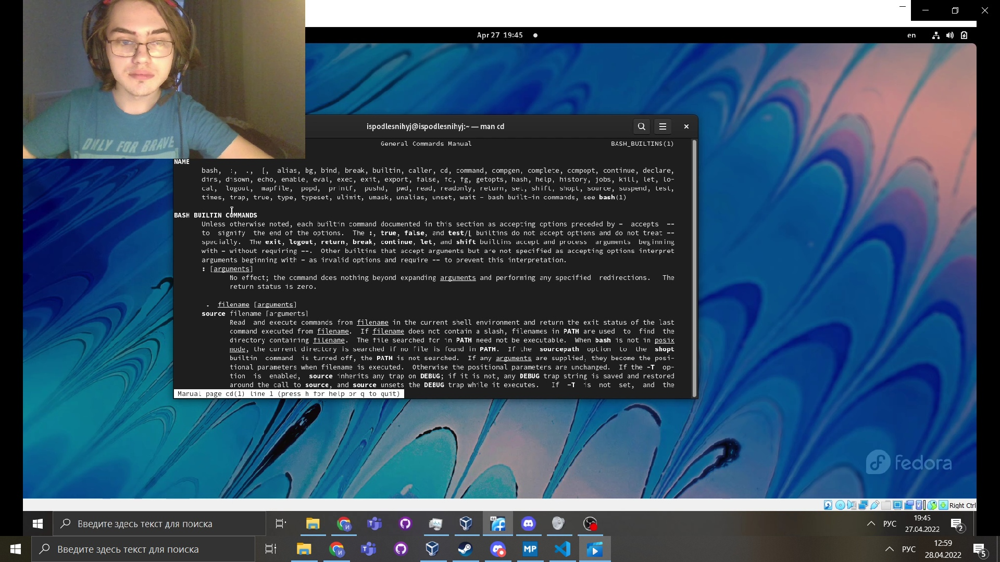

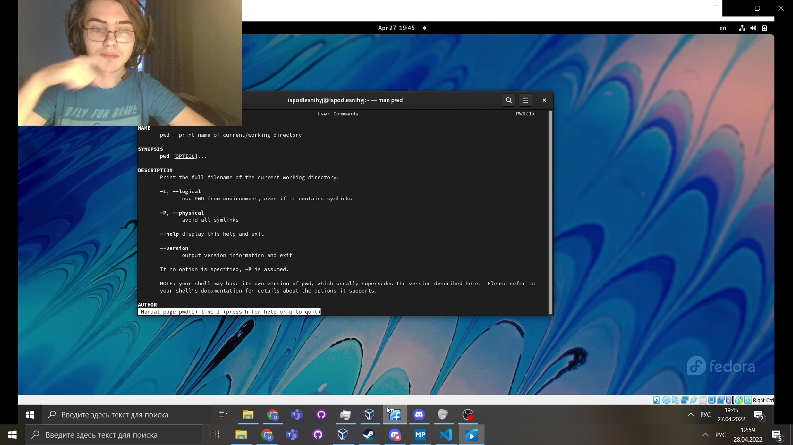

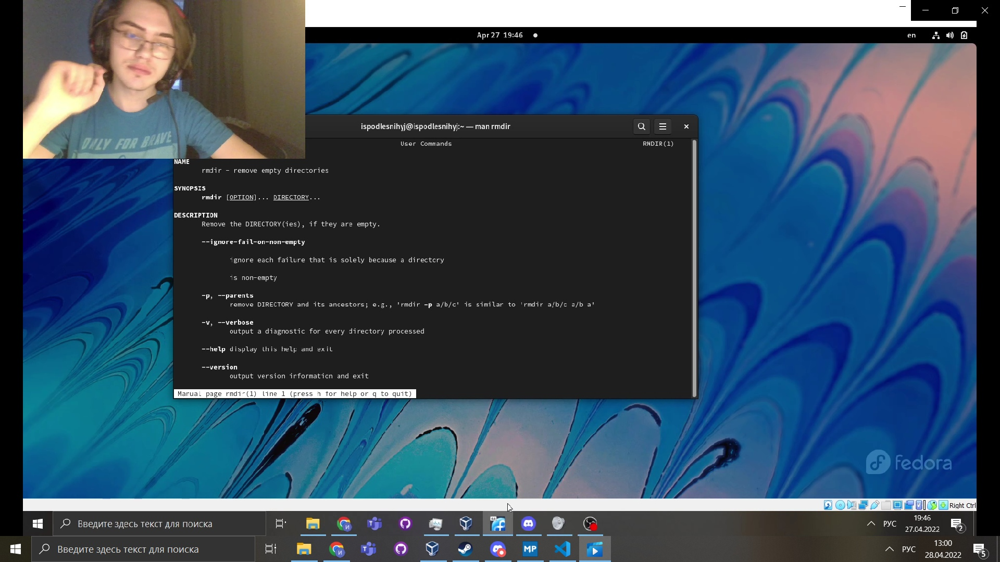

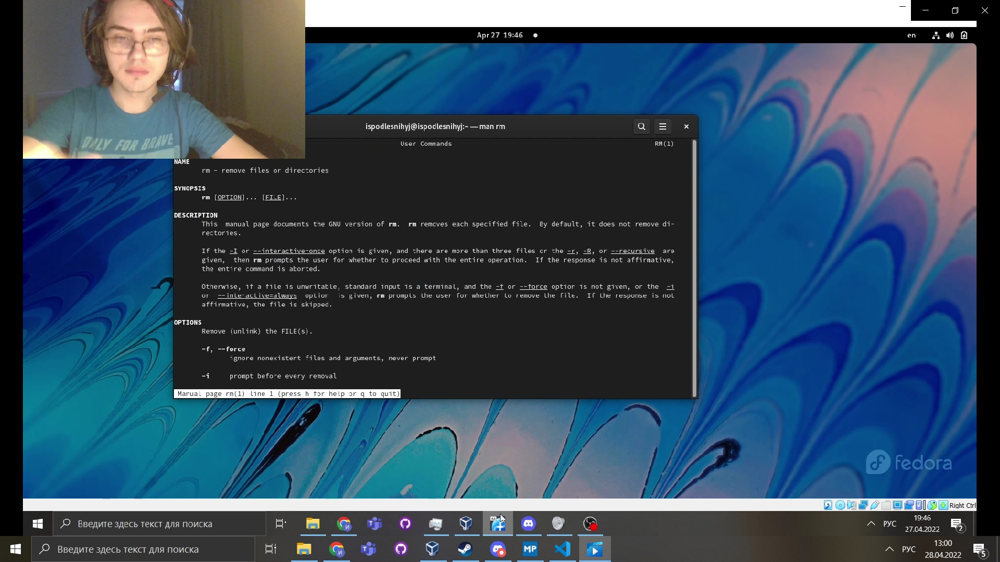

7.Используя информацию, полученную при помощи команды history, выполните модификацию и исполнение нескольких команд из буфера команд.

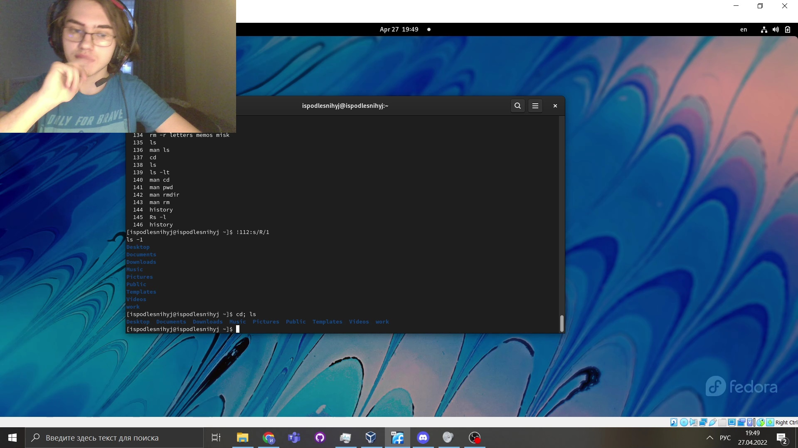

# ВЫВОДЫ

>**Мы Приобрели практические навыки взаимодействия пользователя с системой посредством командной строки.**
