---
## Front matter
title: "Презентация по лабораторной работе №5"
subtitle: "НКНбд-01-21"
author: "Подлесный Иван Сергеевич"

## Generic otions
lang: ru-RU

## Formatting
toc: false
slide_level: 2
theme: metropolis
header-includes: 
 - \metroset{progressbar=frametitle,sectionpage=progressbar,numbering=fraction}
 - '\makeatletter'
 - '\beamer@ignorenonframefalse'
 - '\makeatother'
aspectratio: 43
section-titles: true
---

> 
># ЦЕЛЬ РАБОТЫ

>**Ознакомление с файловой системой Linux, её структурой, именами и содержанием
каталогов. Приобретение практических навыков по применению команд для работы
с файлами и каталогами, по управлению процессами (и работами), по проверке использования диска и обслуживанию файловой системы.**

# Ход работы

## 1. Выполните все примеры, приведённые в первой части описания лабораторной работы (Пример 1)

 

## Пример 2

 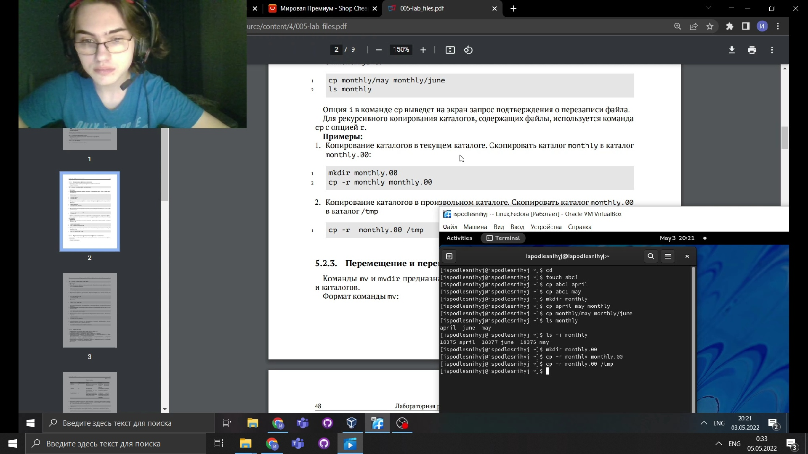

## Пример 3

 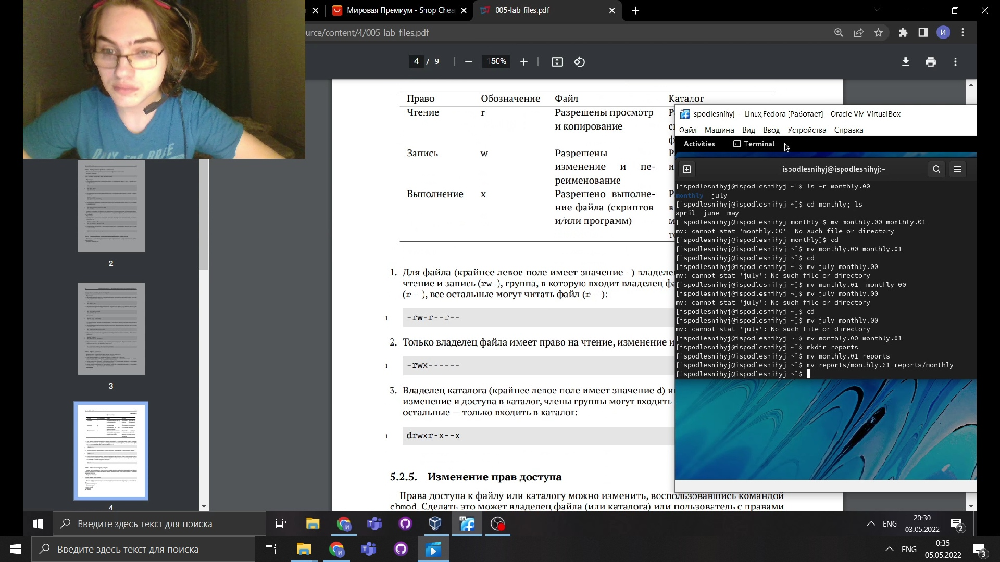

## Пример 4

 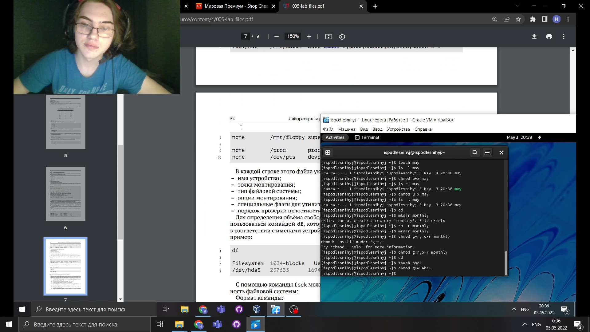

## 2.1 . Скопируйте файл /usr/include/sys/io.h в домашний каталог и назовите его equipment. Если файла io.h нет, то используйте любой другой файл в каталоге /usr/include/sys/ вместо него.
   
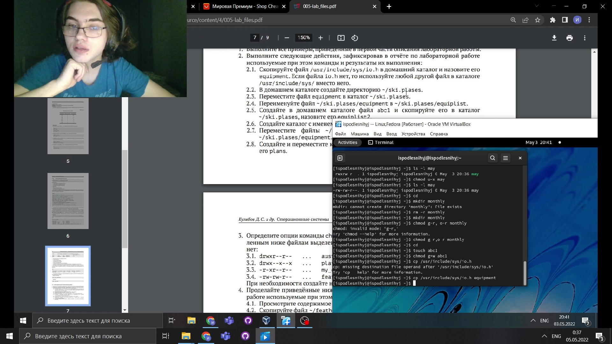

## 2.2-2.3.В домашнем каталоге создайте директорию -/ski.plases и переместите equipment в -/ski.plases

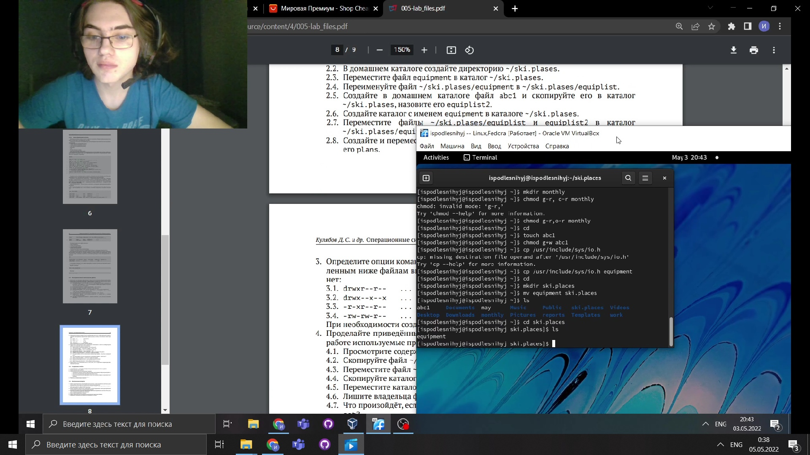

## 2.4. 4. Переименуйте файл -/ski.plases/equipment в -/ski.plases/equiplist.
  

## 2.5  Создайте в домашнем каталоге файл abc1 и скопируйте его в каталог ~/ski.plases, назовите его equiplist2.
  
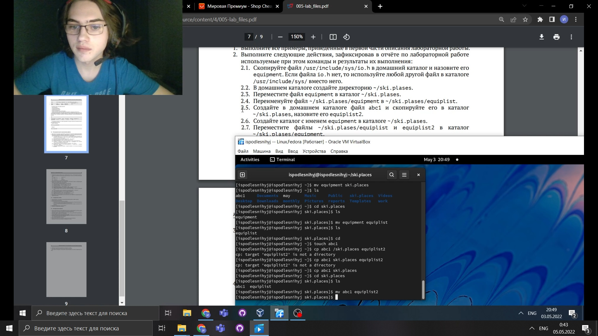

## 2.6 - 2.7. Создайте  equipment в -/ski.plases и Переместите файлы ~/ski.plases/equiplist и equiplist2 в -/ski.plases/equipmen
  
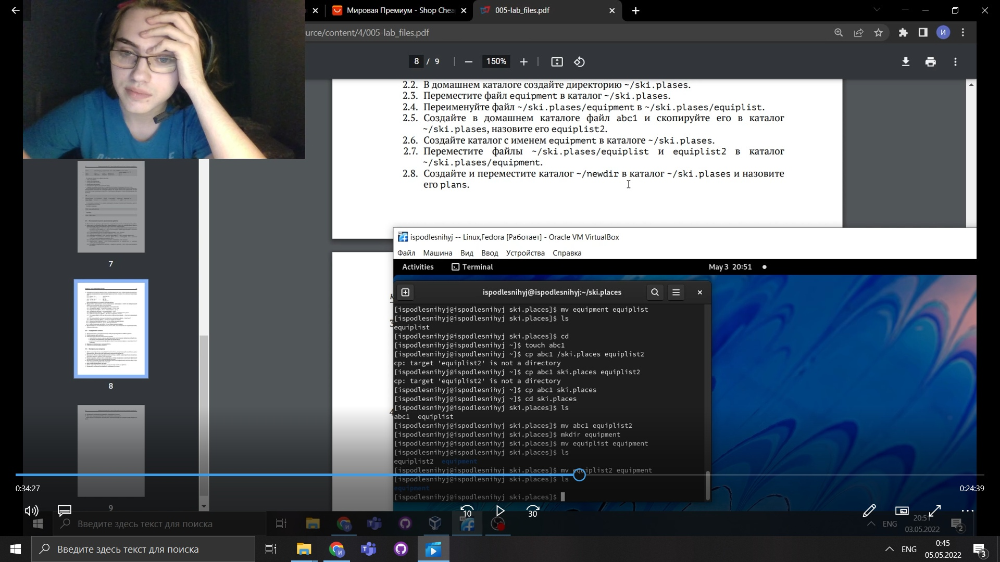

## 2.8 . Создайте и переместите каталог -/newdir в каталог ~/ski.plases и назовите его plans
  
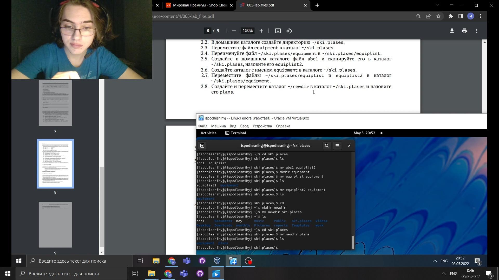

   
## 3.1  Определите опции команды chmod, необходимые для того, чтобы присвоить перечисленным ниже файлам выделенные права доступа, считая, что в начале таких прав нет
   

## 3.2  Определите опции команды chmod, необходимые для того, чтобы присвоить перечисленным ниже файлам выделенные права доступа, считая, что в начале таких прав нет
  

## 3.3  Определите опции команды chmod, необходимые для того, чтобы присвоить перечисленным ниже файлам выделенные права доступа, считая, что в начале таких прав нет

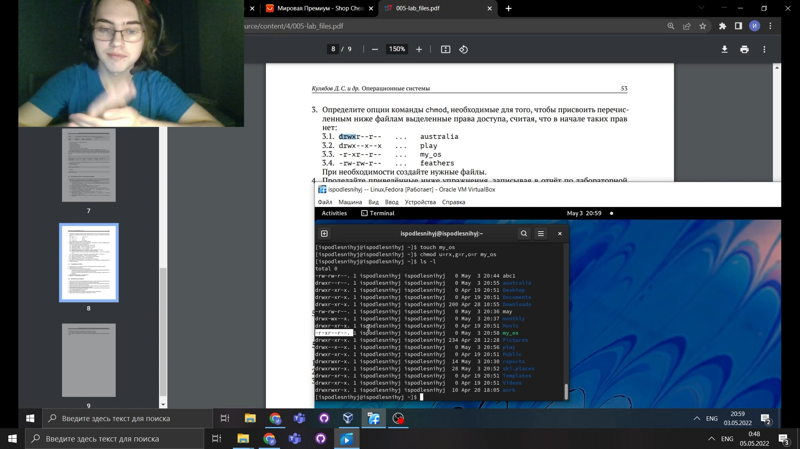

## 3.4  Определите опции команды chmod, необходимые для того, чтобы присвоить перечисленным ниже файлам выделенные права доступа, считая, что в начале таких прав нет
      
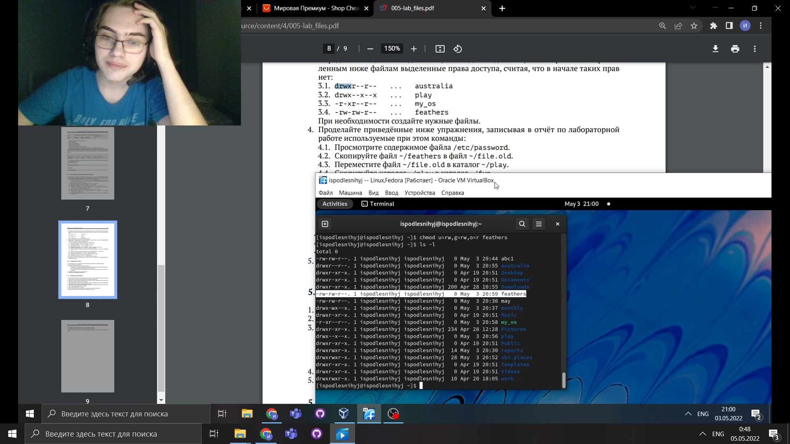

## 4.1 . Просмотрите содержимое файла /etc/password.

 

## 4.2-4.3 Скопируйте файл -/feathers в файл ~/file.old и Переместите файл -/file.old в каталог -/play.

 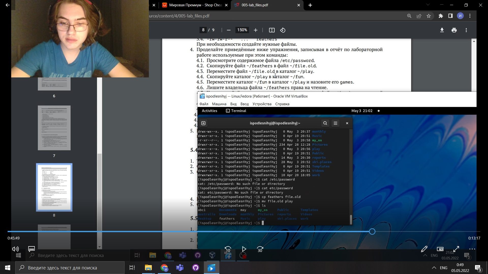

## 4.4 Скопируйте каталог -/play в каталог ~/fun.

 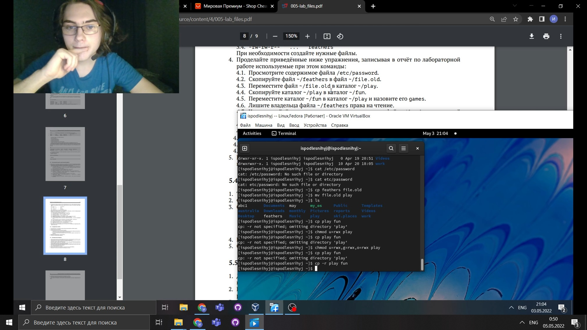

## 4.5 Переместите каталог -/fun в каталог ~/play и назовите его games.

 

## 4.6-4.7 Лишите владельца файла ~/feathers права на чтение и проверьте, что произойдеет при попытке прочтения файла командой cat

 

## 4.8  Что произойдёт, если вы попытаетесь скопировать файл ~/feathers

 

## 4.9 Дайте владельцу файла ~/feathers право на чтение

 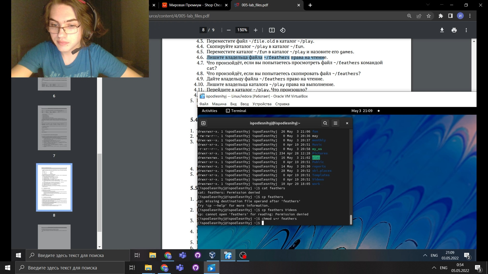

## 4.10-4.12 Лишите владельца каталога ~/play права на выполнение и перейдите в каталог -/play. Что произошло? 

## Дайте владельцу каталога ~/play право на выполнение

 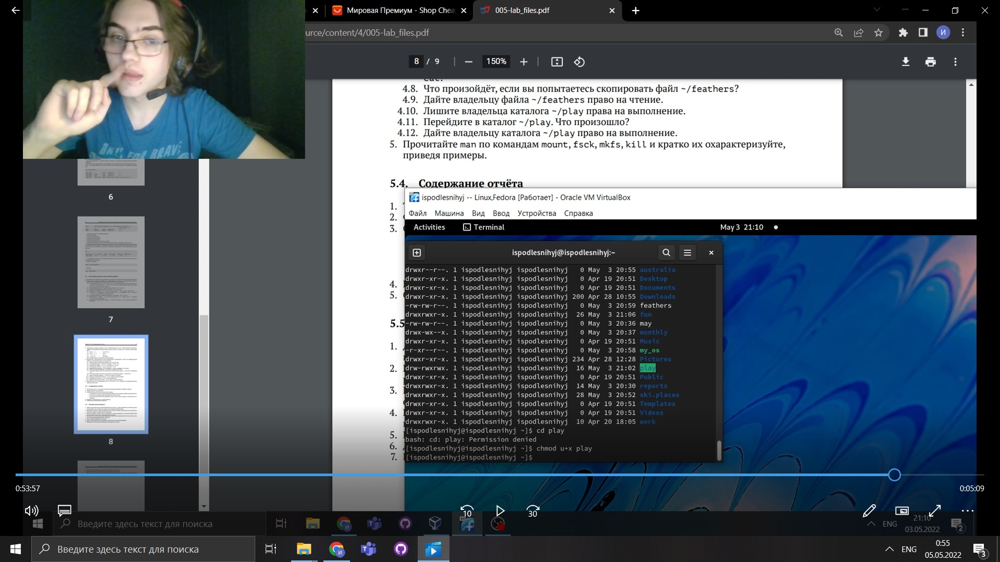

## 5.1 Прочитайте man по командам mount и кратко их охарактеризуйте,приведя примеры

## 5.2 Прочитайте man по командам  fsck и кратко их охарактеризуйте,приведя примеры

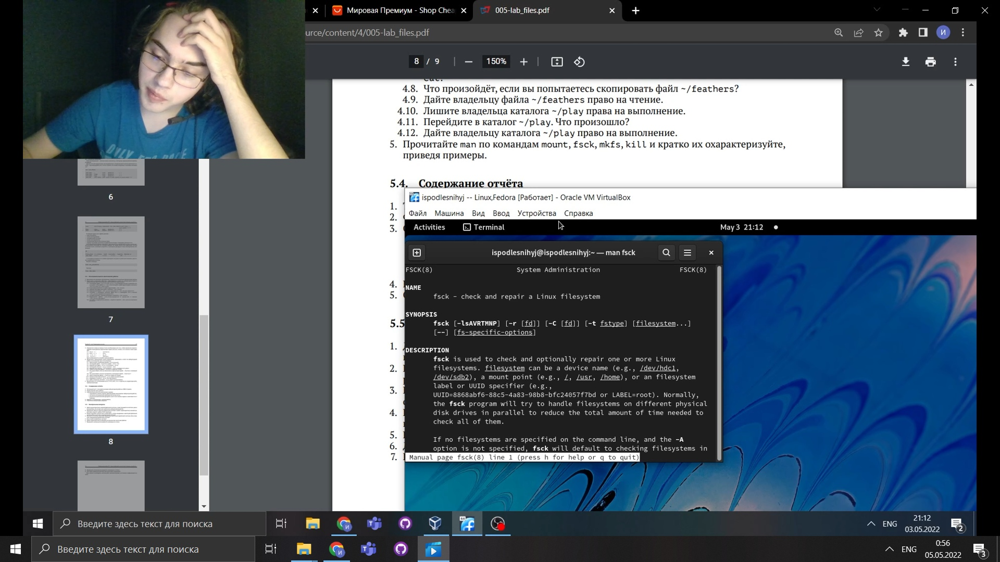

## 5.3 Прочитайте man по командам  mkfs и кратко их охарактеризуйте,приведя примеры

## 5.4 Прочитайте man по командам kill и кратко их охарактеризуйте,приведя примеры

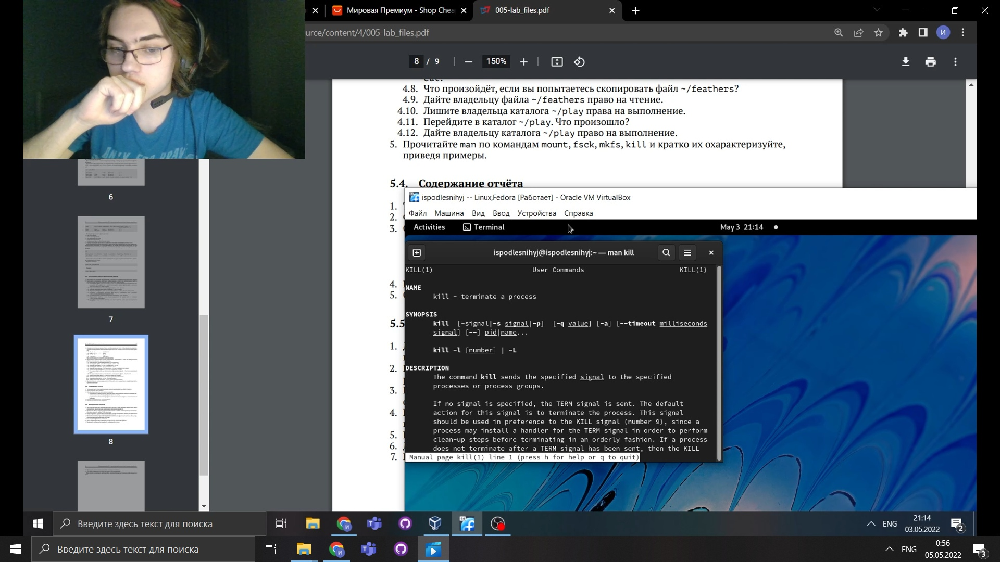

# ВЫВОДЫ

>** Мы ознакомились с файловой системой Linux, её структурой, именами и содержанием
каталогов и приобрели практических навыков по применению команд для работы
с файлами и каталогами, по управлению процессами (и работами), по проверке использования диска и обслуживанию файловой системы. **