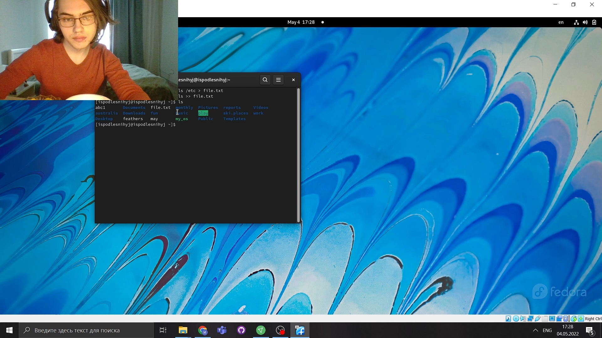

---
## Front matter
title: "Презентация по лабораторной работе №6"
subtitle: "НКНбд-01-21"
author: "Подлесный Иван Сергеевич"

## Generic otions
lang: ru-RU

## Formatting
toc: false
slide_level: 2
theme: metropolis
header-includes: 
 - \metroset{progressbar=frametitle,sectionpage=progressbar,numbering=fraction}
 - '\makeatletter'
 - '\beamer@ignorenonframefalse'
 - '\makeatother'
aspectratio: 43
section-titles: true
---

> 
># ЦЕЛЬ РАБОТЫ

>** Ознакомление с инструментами поиска файлов и фильтрации текстовых данных.
Приобретение практических навыков: по управлению процессами (и заданиями), по
проверке использования диска и обслуживанию файловых систем.  **

# Ход работы

## 1. Осуществите вход в систему, используя соответствующее имя пользователя

## 2. Запишите в файл file.txt названия файлов, содержащихся в каталоге /etc. Допишите в этот же файл названия файлов, содержащихся в вашем домашнем каталоге

 
   
## 3. Выведите имена всех файлов из file.txt, имеющих расширение .conf, после чего запишите их в новый текстовой файл conf.txt

 

## 4.1  Определите, какие файлы в вашем домашнем каталоге имеют имена, начинавшиеся с символа c? Предложите несколько вариантов, как это сделать

## 4.2 Предложите несколько вариантов, как это сделать

## 5. Выведите на экран (по странично) имена файлов из каталога /etc, начинающиеся с символа h.

## 6.  Запустите в фоновом режиме процесс, который будет записывать в файл ~/logfile файлы, имена которых начинаются с log.

 

## 7. Удалите файл ~/logfile.

 
## 8.  Запустите из консоли в фоновом режиме редактор gedit 

## 9.Определите идентификатор процесса gedit, используя команду ps, конвейер и фильтр grep. Как ещё можно определить идентификатор процесса?

## 10.1 Прочтите справку (man) команды kill

## 10.2 используйте её для завершения процесса gedit.

## 11.1 Получите информацию о команде df

## 11.2 Получите информацию о команде du

## 11.3 исполните команду df

## 11.4 используйте команду du

## 12.1 Воспользовавшись справкой команды find 

## 12.2 выведите имена всех директорий, имеющихся в вашем домашнем каталоге

# ВЫВОДЫ

>** Мы ознакомились с инструментами поиска файлов и фильтрации текстовых данных и
приобрели практические навыки  по управлению процессами (и заданиями), по
проверке использования диска и по обслуживанию файловых систем. **