---
## Front matter
title: "Отчёт по лабораторной работе №6"
subtitle: "НКНбд-01-21"
author: "Подлесный Иван Сергеевич"

## Generic otions
lang: ru-RU
toc-title: "Содержание"

## Bibliography
bibliography: bib/cite.bib
csl: pandoc/csl/gost-r-7-0-5-2008-numeric.csl

## Pdf output format
toc: true # Table of contents
toc-depth: 2
fontsize: 12pt
linestretch: 1.5
papersize: a4
documentclass: scrreprt
## I18n polyglossia
polyglossia-lang:
  name: russian
  options:
	- spelling=modern
	- babelshorthands=true
polyglossia-otherlangs:
  name: english
## I18n babel
babel-lang: russian
babel-otherlangs: english
## Fonts
mainfont: PT Serif
romanfont: PT Serif
sansfont: PT Sans
monofont: PT Mono
mainfontoptions: Ligatures=TeX
romanfontoptions: Ligatures=TeX
sansfontoptions: Ligatures=TeX,Scale=MatchLowercase
monofontoptions: Scale=MatchLowercase,Scale=0.9
## Biblatex
biblatex: true
biblio-style: "gost-numeric"
biblatexoptions:
  - parentracker=true
  - backend=biber
  - hyperref=auto
  - language=auto
  - autolang=other*
  - citestyle=gost-numeric
## Pandoc-crossref LaTeX customization
figureTitle: "Рис."
tableTitle: "Таблица"
listingTitle: "Листинг"
lofTitle: "Цель Работы"
lotTitle: "Ход Работы"
lolTitle: "Листинги"
## Misc options
indent: true
header-includes:
  - \usepackage{indentfirst}
  - \usepackage{float} # keep figures where there are in the text
  - \floatplacement{figure}{H} # keep figures where there are in the text
---

># ЦЕЛЬ РАБОТЫ

>**Ознакомление с инструментами поиска файлов и фильтрации текстовых данных.
Приобретение практических навыков: по управлению процессами (и заданиями), по
проверке использования диска и обслуживанию файловых систем. **

# Ход работы

 1.  Осуществите вход в систему, используя соответствующее имя пользователя

 2.  Запишите в файл file.txt названия файлов, содержащихся в каталоге /etc. Допишите в этот же файл названия файлов, содержащихся в вашем домашнем каталоге
   
   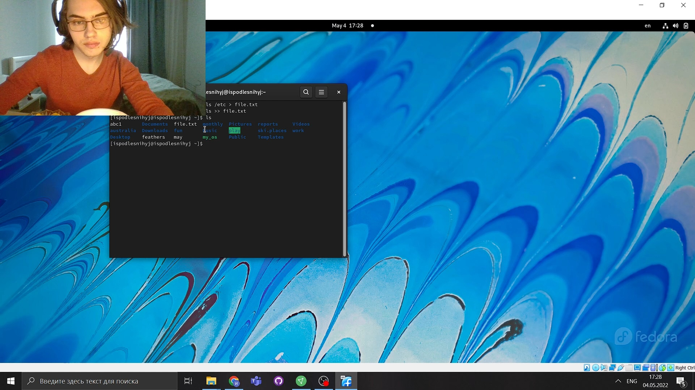

 3.  Выведите имена всех файлов из file.txt, имеющих расширение .conf, после чего
запишите их в новый текстовой файл conf.txt

   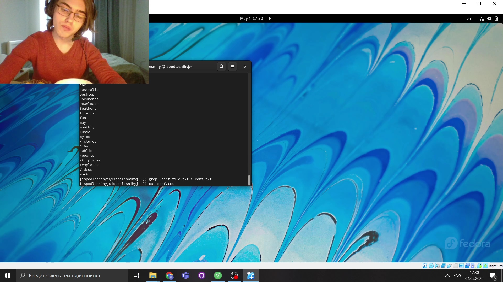

 4.  Определите, какие файлы в вашем домашнем каталоге имеют имена, начинавшиеся
с символа c? Предложите несколько вариантов, как это сделать.

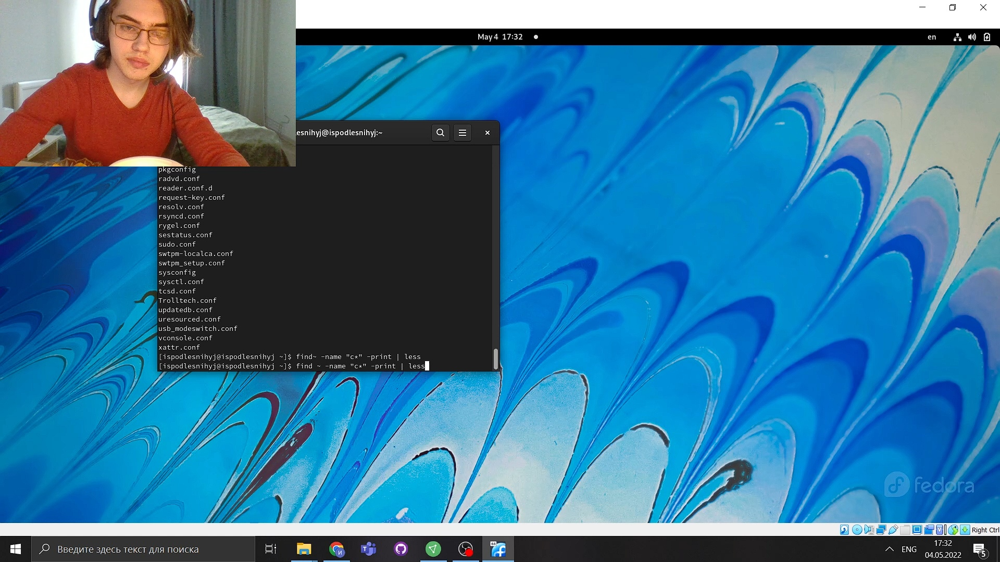

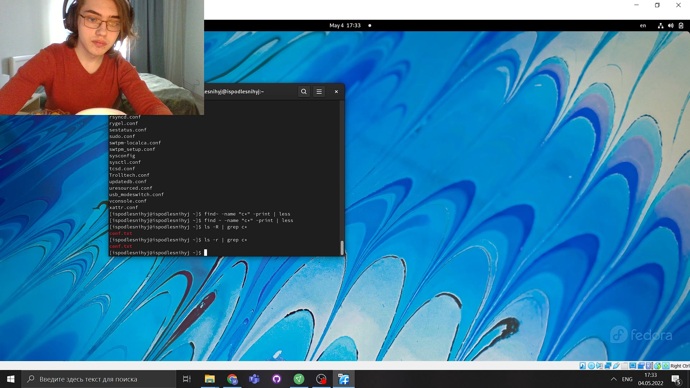

 5.  Выведите на экран (по странично) имена файлов из каталога /etc, начинающиеся
с символа h.

 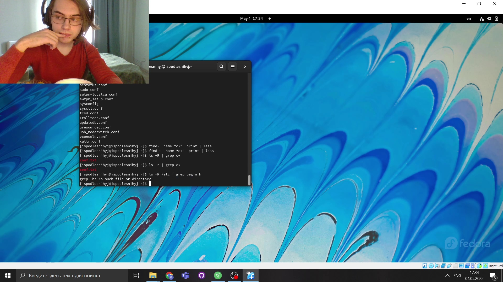

 6.  Запустите в фоновом режиме процесс, который будет записывать в файл ~/logfile
файлы, имена которых начинаются с log.

 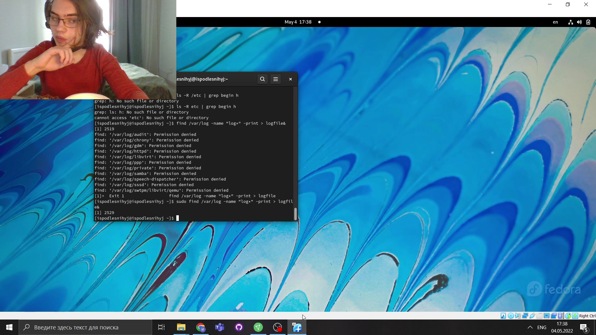

 7.  Удалите файл ~/logfile.

 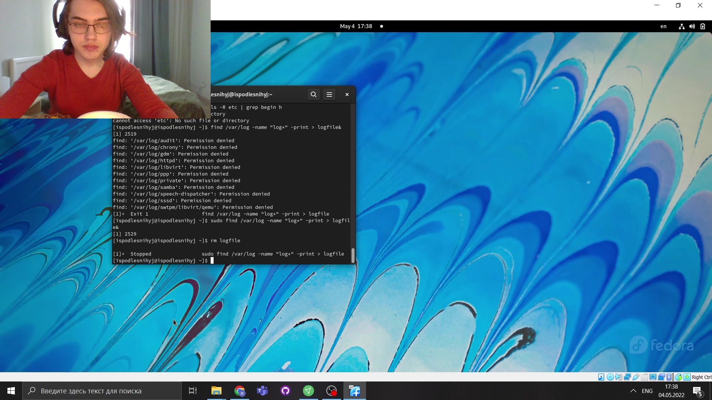

 8.  Запустите из консоли в фоновом режиме редактор gedit

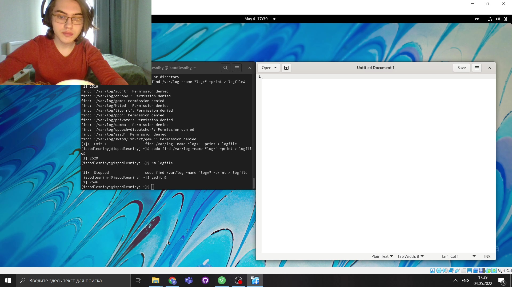

 9.  Определите идентификатор процесса gedit, используя команду ps, конвейер и фильтр
grep. Как ещё можно определить идентификатор процесса?

 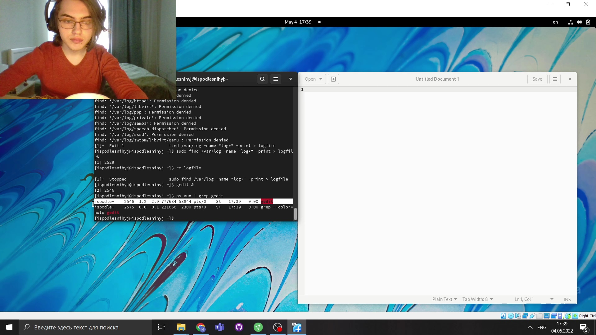

 10. Прочтите справку (man) команды kill, после чего используйте её для завершения
процесса gedit.

 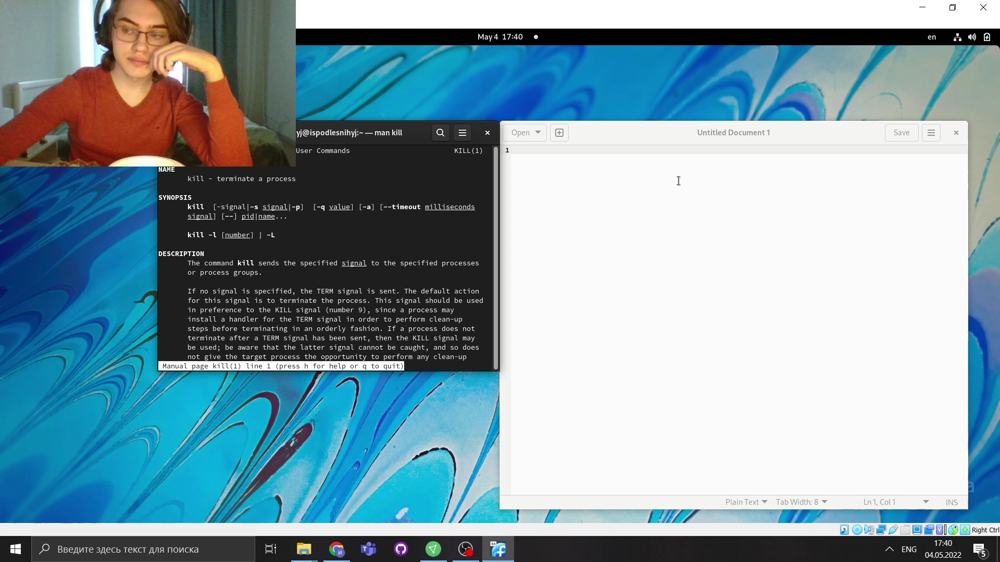

 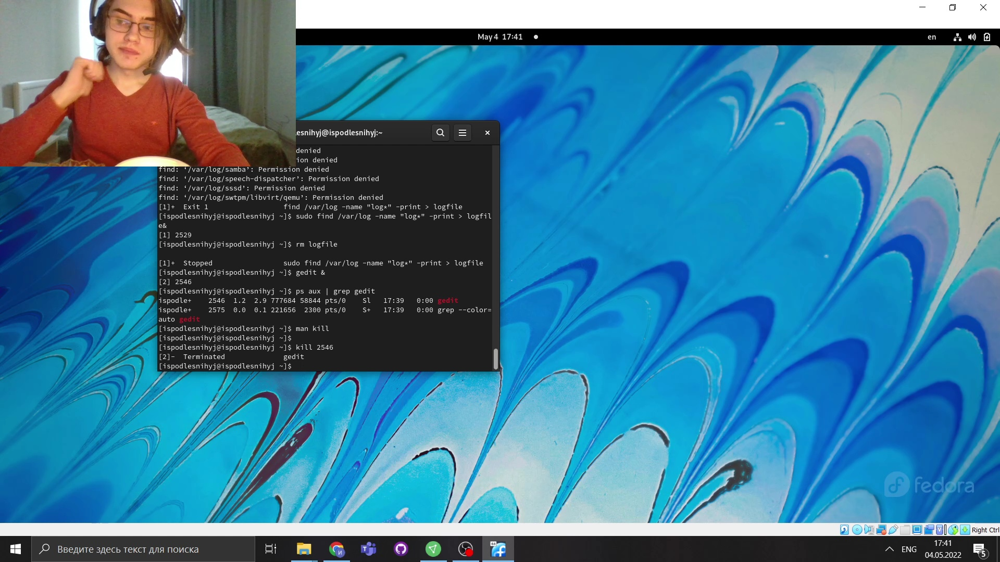

 11.  Выполните команды df и du, предварительно получив более подробную информацию
об этих командах, с помощью команды man.

 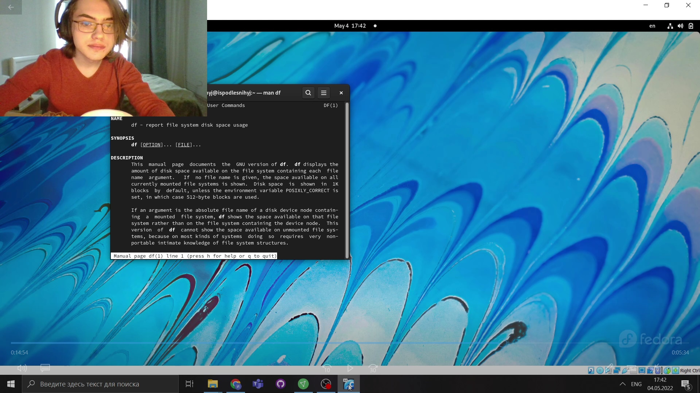

 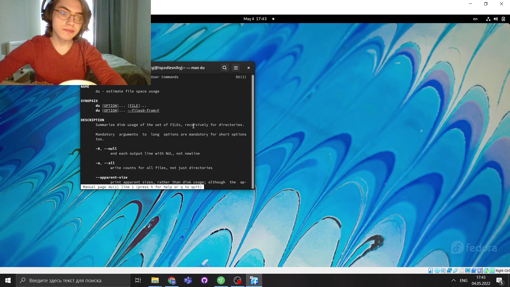

 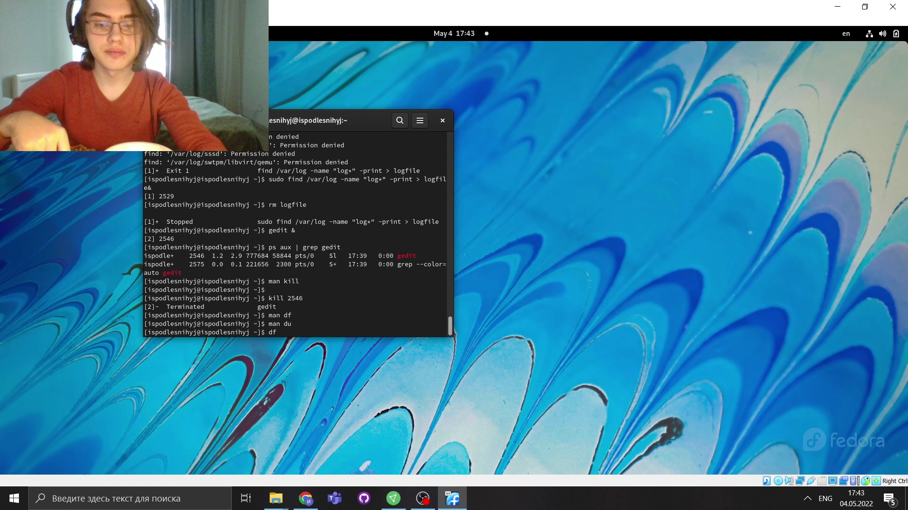

 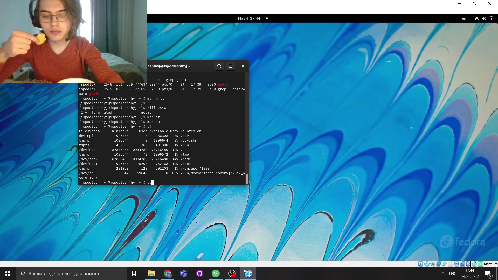

 12. Воспользовавшись справкой команды find, выведите имена всех директорий, имеющихся в вашем домашнем каталоге

 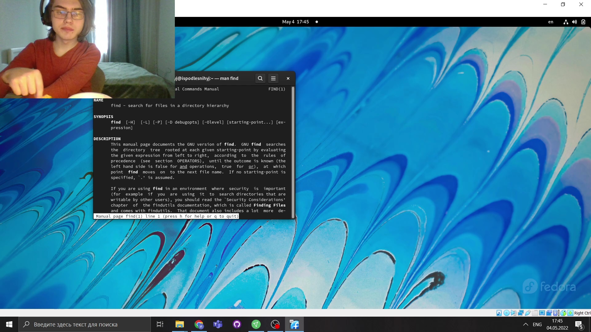

 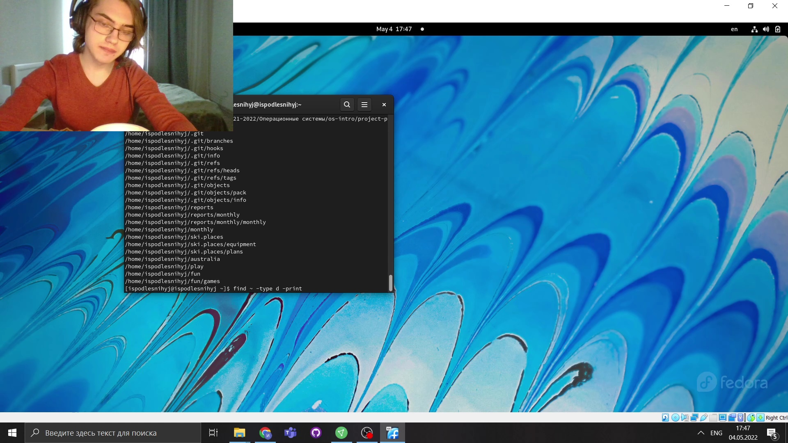
   

# ВЫВОДЫ

>**Мы ознакомились с инструментами поиска файлов и фильтрации текстовых данных и
приобрели практические навыки  по управлению процессами (и заданиями), по
проверке использования диска и по обслуживанию файловых систем.**

# Контрольные вопросы

1. stdin — стандартный поток ввода (по умолчанию: клавиатура), файловый дескриптор 0.

2. /> - открытие файла для перенаправления потока. /» - файл открывается в режиме добавления.

3. Конвейер (pipe) служит для объединения простых команд или утилит в цепочки,в которых результат работы предыдущей команды передаётся последующей. Синтаксис следующий: команда 1 | команда 2 означает, что вывод команды 1 передастся на ввод команде 2.

4. Процессы в linux можно описать как контейнеры, в которых хранится вся информация о состоянии и выполнении программы.

5. Process IDentifier, PID — уникальный номер (идентификатор процесса. (GID) - обозначает группу, к которой относится пользователь.

6. Запущенные фоном программы называются задачами (jobs). Ими можно управлять с помощью команды jobs, которая выводит список запущенных в данный момент задач.

7. top - позволяет выводить информацию о системе, а также список процессов динамически обновляя информацию о потребляемых ими ресурсах. Команда htop похожа на команду top по выполняемой функции: они обе показывают информацию о процессах в реальном времени, выводят данные о потреблении системных ресурсов и позволяют искать, останавливать и управлять процессами. В программе htop реализован очень удобный поиск по процессам, а также их фильтрация.

8. Команда find используется для поиска и отображения имён файлов, соответствующих заданной строке символов. Формат команды: find путь [-опции] Путь определяет каталог, начиная с которого по всем подкаталогам будет вестисьпоиск. Пример: Вывести на экран имена файлов из вашего домашнего каталога и его подкаталогов, начинающихся на f: find ~ -name "f*" -print где ~ — обозначение вашего домашнего каталога, -name — после этой опции указывается имя файла, который нужно найти, "f*" — строка символов, определяющая имя файла, -print — опция, задающая вывод результатов поиска на экран.

9. Можно найти файл по контексту (содержанию) используя комбинацию команд find и grep. find -type f -exec grep -H 'text'.

10. Определить объем свободной памяти на жёстком диске можно с помощью df -h.

11. Определить объем домашнего каталога можно командой du -s.

12. Для завершения процесса необходимо выполнить команду kill [номер задач].