---
## Front matter
title: "Отчёт по лабораторной работе №7"
subtitle: "НКНбд-01-21"
author: "Подлесный Иван Сергеевич"

## Generic otions
lang: ru-RU
toc-title: "Содержание"

## Bibliography
bibliography: bib/cite.bib
csl: pandoc/csl/gost-r-7-0-5-2008-numeric.csl

## Pdf output format
toc: true # Table of contents
toc-depth: 2
fontsize: 12pt
linestretch: 1.5
papersize: a4
documentclass: scrreprt
## I18n polyglossia
polyglossia-lang:
  name: russian
  options:
	- spelling=modern
	- babelshorthands=true
polyglossia-otherlangs:
  name: english
## I18n babel
babel-lang: russian
babel-otherlangs: english
## Fonts
mainfont: PT Serif
romanfont: PT Serif
sansfont: PT Sans
monofont: PT Mono
mainfontoptions: Ligatures=TeX
romanfontoptions: Ligatures=TeX
sansfontoptions: Ligatures=TeX,Scale=MatchLowercase
monofontoptions: Scale=MatchLowercase,Scale=0.9
## Biblatex
biblatex: true
biblio-style: "gost-numeric"
biblatexoptions:
  - parentracker=true
  - backend=biber
  - hyperref=auto
  - language=auto
  - autolang=other*
  - citestyle=gost-numeric
## Pandoc-crossref LaTeX customization
figureTitle: "Рис."
tableTitle: "Таблица"
listingTitle: "Листинг"
lofTitle: "Цель Работы"
lotTitle: "Ход Работы"
lolTitle: "Листинги"
## Misc options
indent: true
header-includes:
  - \usepackage{indentfirst}
  - \usepackage{float} # keep figures where there are in the text
  - \floatplacement{figure}{H} # keep figures where there are in the text
---

># ЦЕЛЬ РАБОТЫ

>>**Освоение основных возможностей командной оболочки Midnight Commander. Приобретение навыков практической работы по просмотру каталогов и файлов; манипуляций с ними**

# Ход работы

1. Изучите информацию о mc, вызвав в командной строке man mc

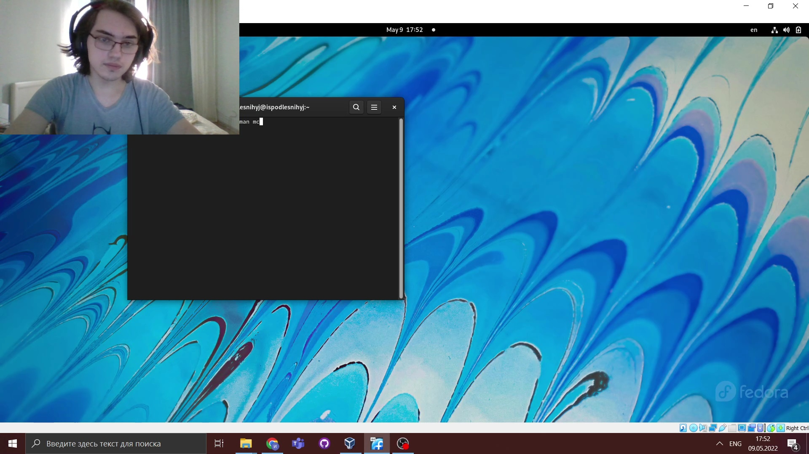

2. Запустите из командной строки mc, изучите его структуру и меню.

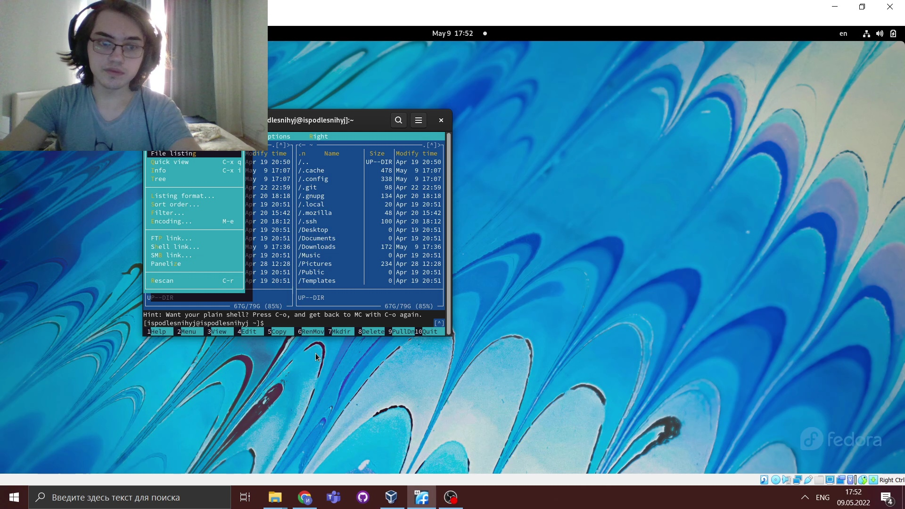

3. 1.  Выполните в mc, используя управляющие клавиши выделение/отмена выделения файлов и т.п.)

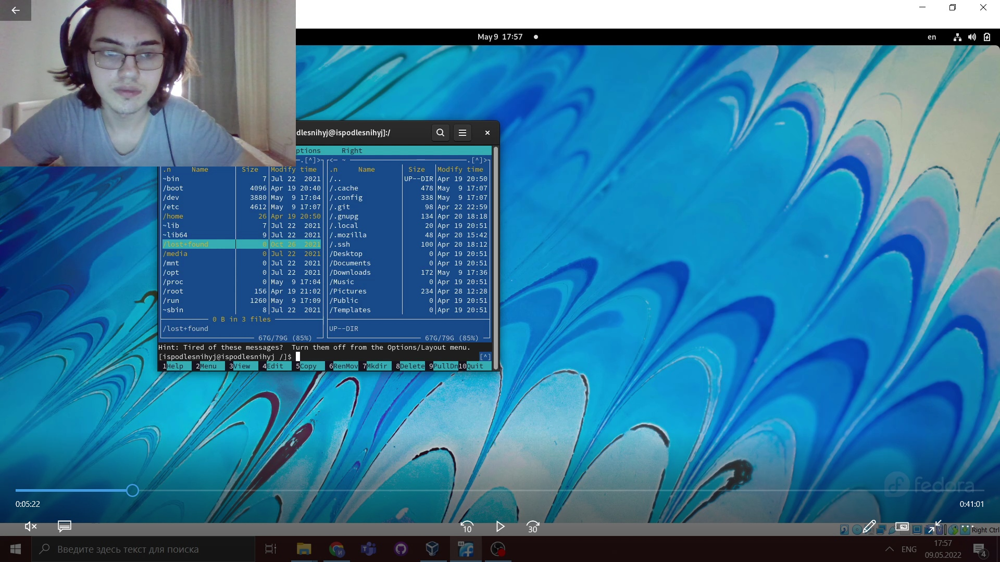

3. 2. Выполните в mc, используя управляющие клавиши опирование/перемещение файлов,
  
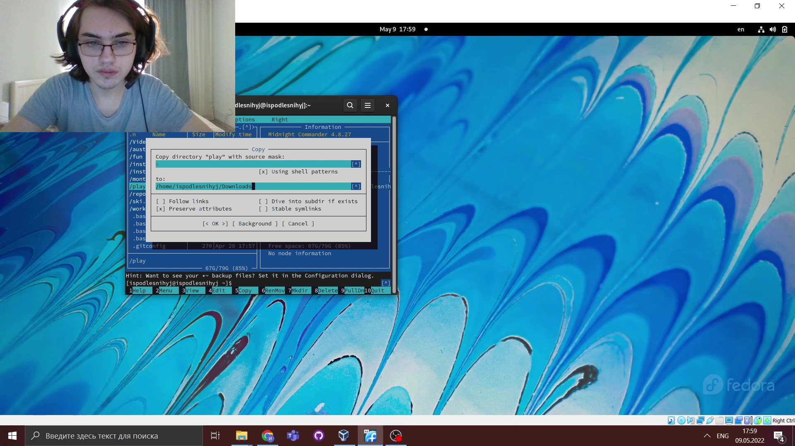

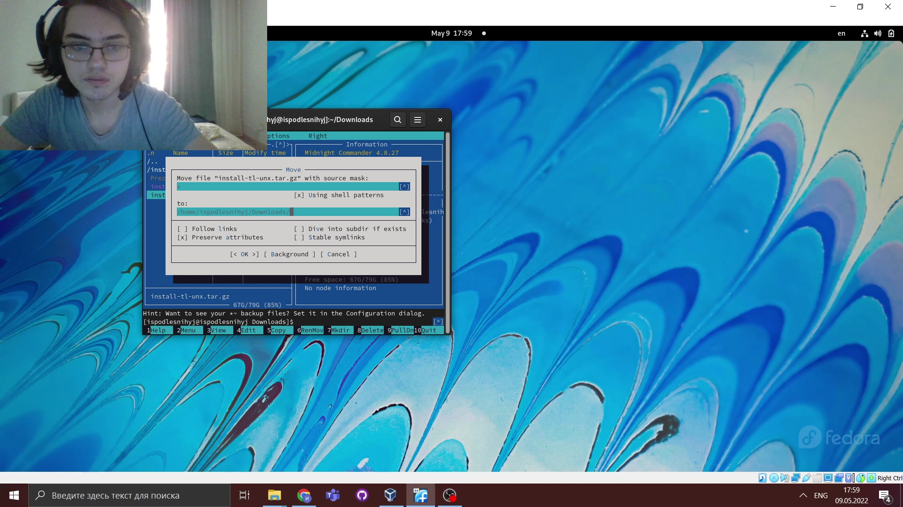

3. 3. Выполните в mc, используя управляющие клавиши  получение информации о размере и правах доступа на файлы и/или каталоги

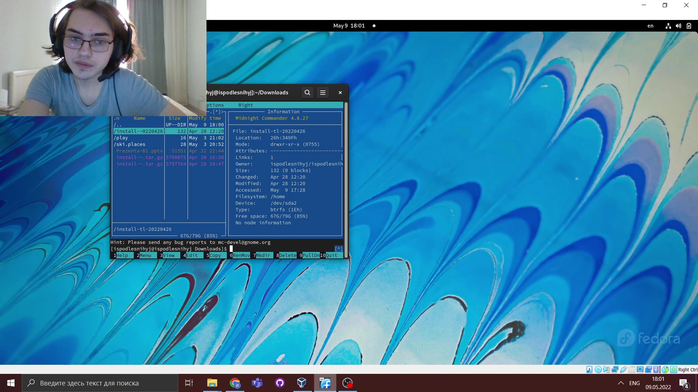

4. Выполните основные команды меню левой (или правой) панели. Оцените степень подробности вывода информации о файлах.

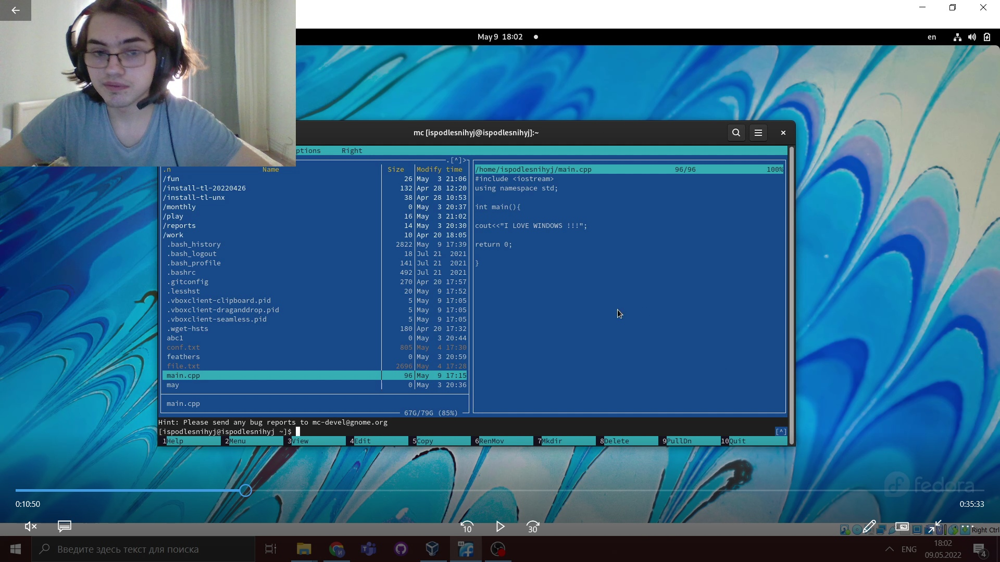

5. 1. Используя возможности подменю Файл , выполните  просмотр содержимого текстового файла и редактирование содержимого текстового файла (без сохранения результатов редактирования);

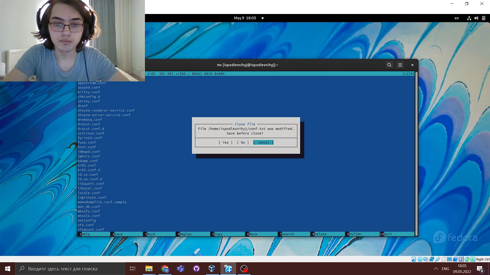

5. 2. Используя возможности подменю Файл , выполните создание каталога

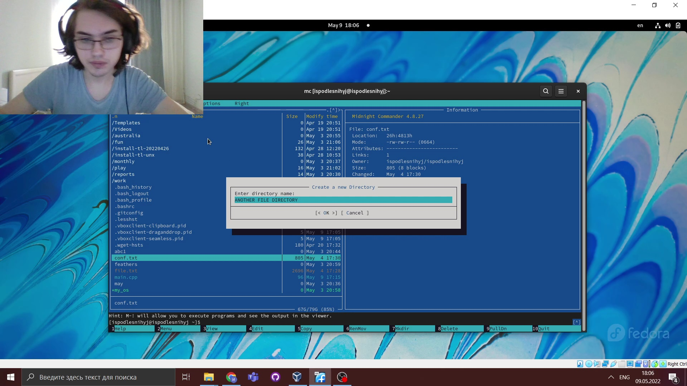

1. 3. Используя возможности подменю Файл , выполните копирование в файлов в созданный каталог.

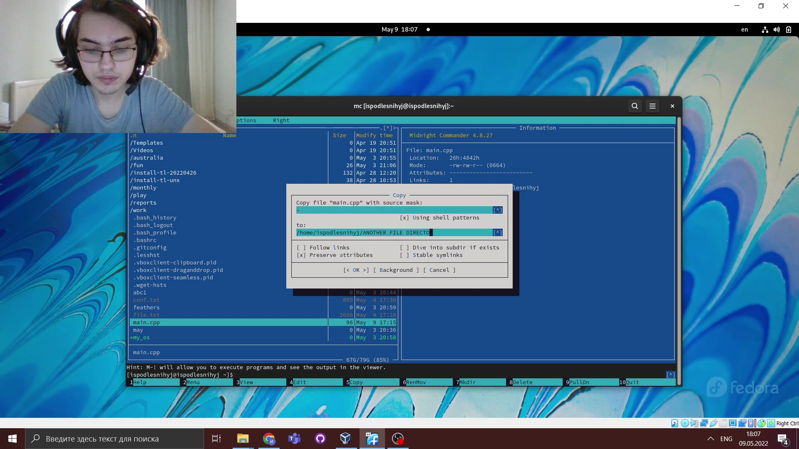

6. 1. С помощью соответствующих средств подменю Команда осуществите поиск в файловой системе файла с заданными условиями (например, файла с расширением .c или .cpp, содержащего строку main);

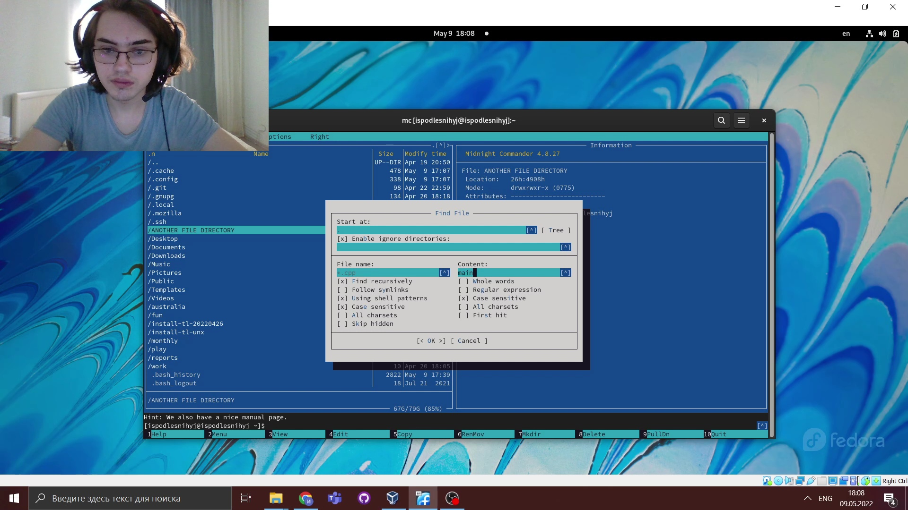

6. 2. С помощью соответствующих средств подменю Команда осуществите  выбор и повторение одной из предыдущих команд;

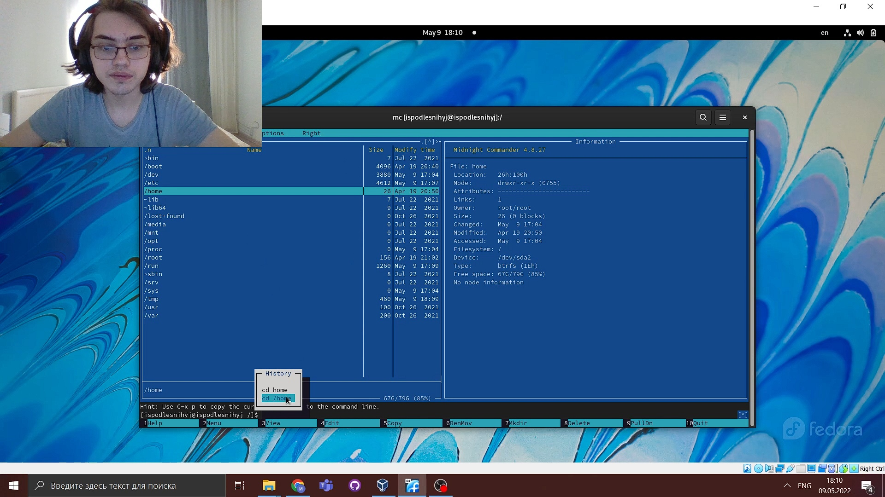

6. 3.  С помощью соответствующих средств подменю Команда осуществите  переход в домашний каталог;

6. 4.  С помощью соответствующих средств подменю Команда осуществите  анализ файла меню и файла расширений.

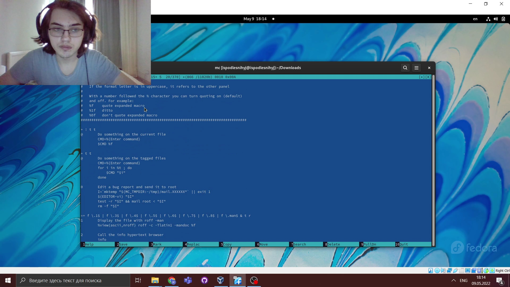

7. Вызовите подменю Настройки . Освойте операции, определяющие структуру экрана mc

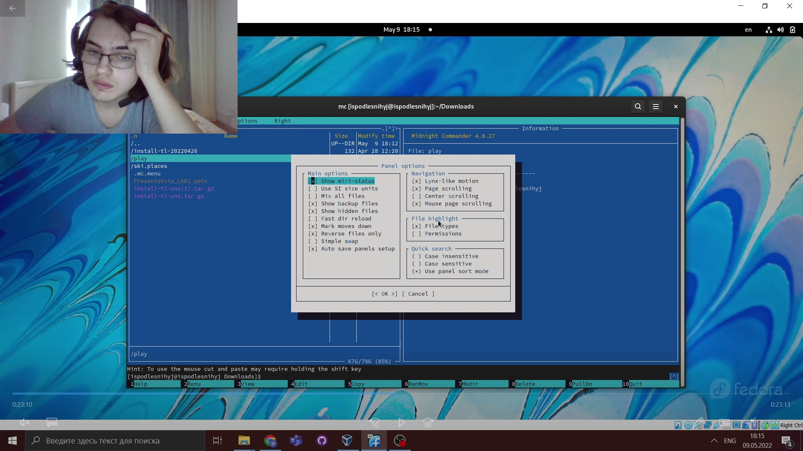

8. Создайте текстовой файл text.txt
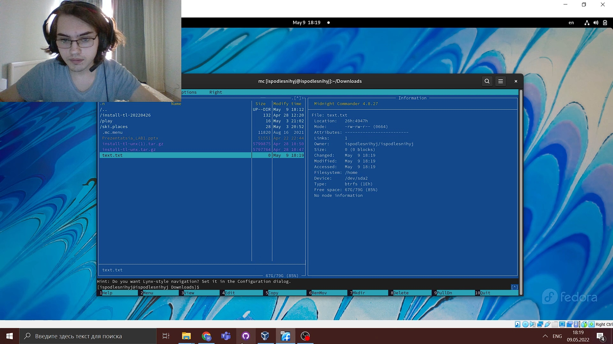

9. Вставьте в открытый файл небольшой фрагмент текста, скопированный из любого другого файла или Интернета., Проделайте с текстом следующие манипуляции, используя горячие клавиши:

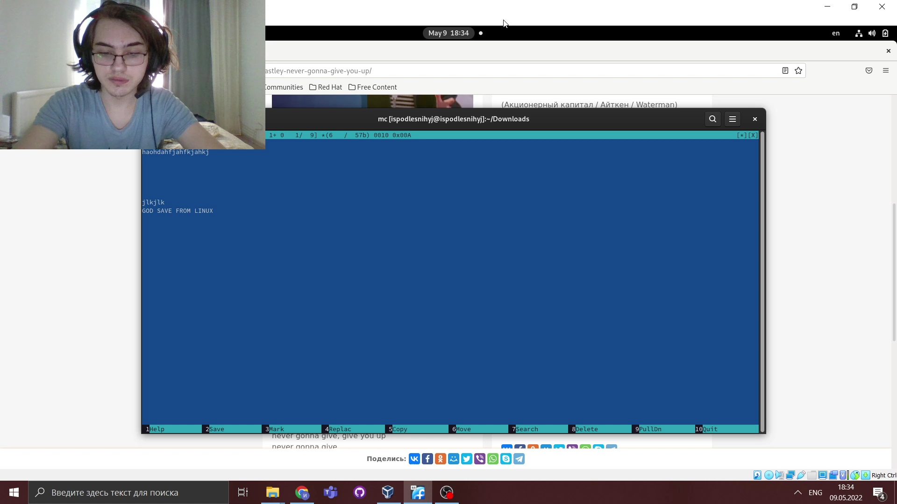

10. Откройте файл с исходным текстом на некотором языке программирования (например C или Java)

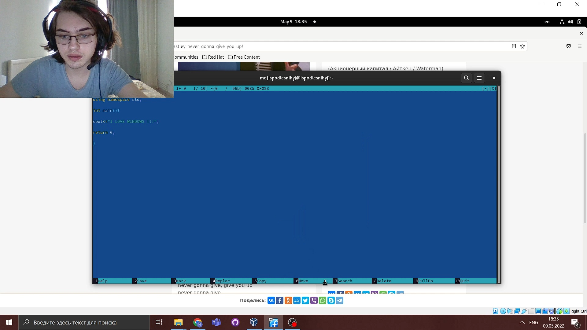

11. Используя меню редактора, включите подсветку синтаксиса, если она не включена, или выключите, если она включена.

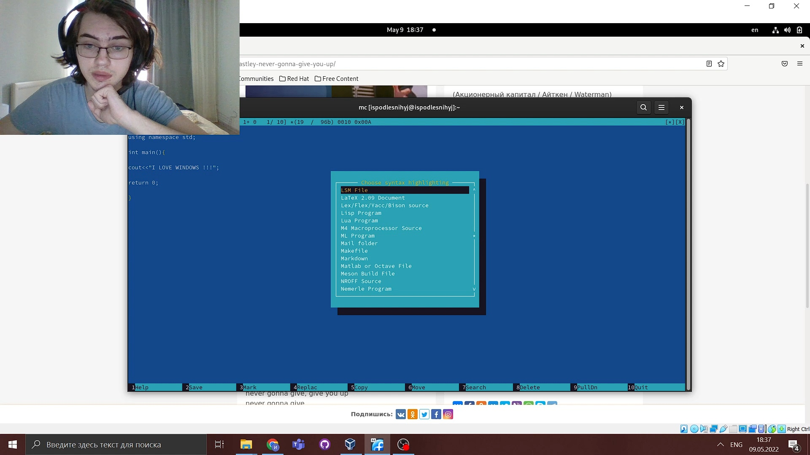

# ВЫВОДЫ

>**Мы Освоили основные возможности командной оболочки Midnight Commander и приобрели навыки практической работы по просмотру каталогов и файлов и манипуляций с ними**
