---
## Front matter
title: "Презентация по лабораторной работе №8"
subtitle: "НКНбд-01-21"
author: "Подлесный Иван Сергеевич"

## Generic otions
lang: ru-RU

## Formatting
toc: false
slide_level: 2
theme: metropolis
header-includes: 
 - \metroset{progressbar=frametitle,sectionpage=progressbar,numbering=fraction}
 - '\makeatletter'
 - '\beamer@ignorenonframefalse'
 - '\makeatother'
aspectratio: 43
section-titles: true
---

>
># ЦЕЛЬ РАБОТЫ

>**Познакомиться с операционной системой Linux. Получить практические навыки работы с редактором vi, установленным по умолчанию практически во всех дистрибутивах.**

# Ход работы

## 1-2 Создайте каталог с именем ~/work/os/lab06 и перейдите во вновь созданный каталог

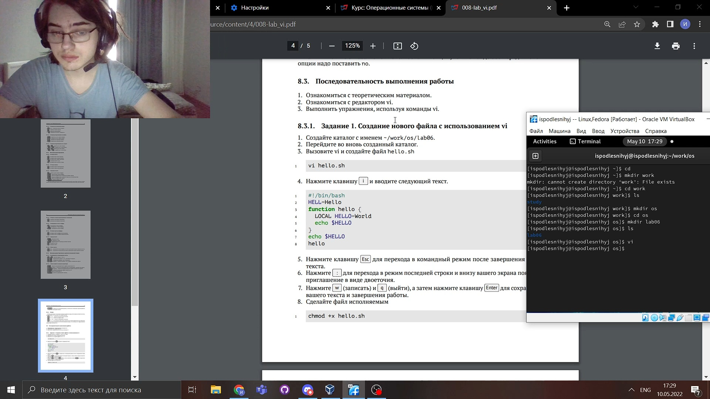

## 3-4 вызовите vi и создайте файл hello.sh и Нажмите клавишу i и вводите следующий текст.

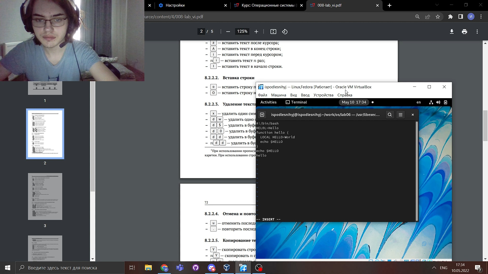

## 5-7  Перейдите в командный режим после завершения ввода текста, перейдите в режим последней строки Нажмите w (записать) и q (выйти), а затем нажмите клавишу Enter для сохранения вашего текста и завершения работы.

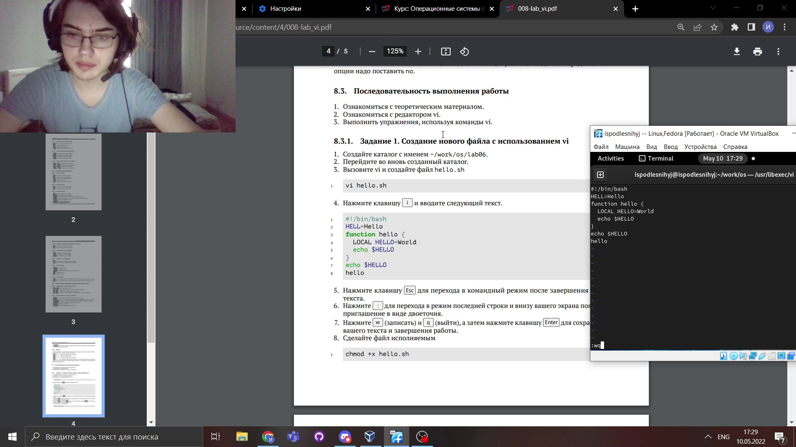

## 8 Сделайте файл исполняемым
  
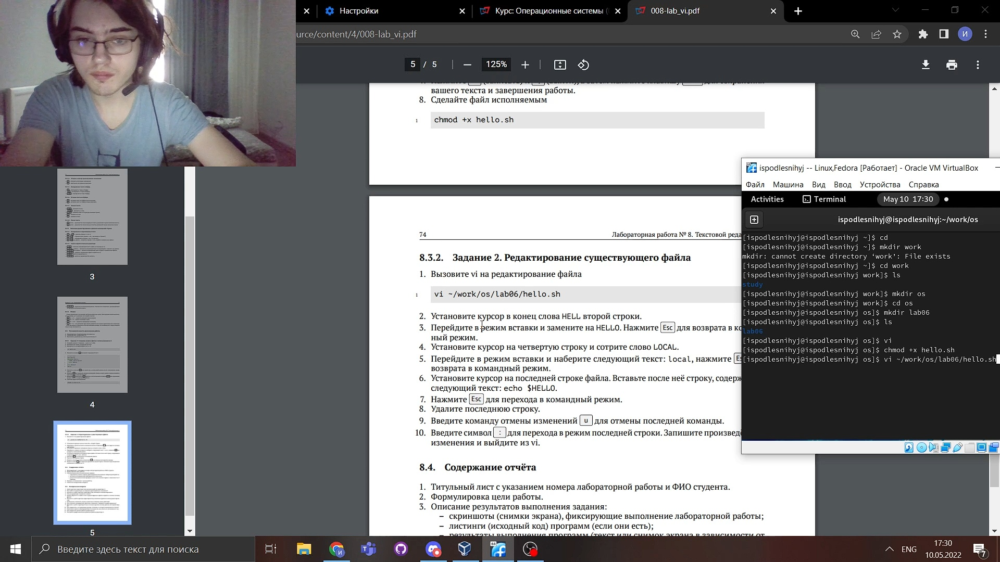

## 1.1 Вызовите vi на редактирование файла

## 2.1 Установите курсор в конец слова HELL второй строки

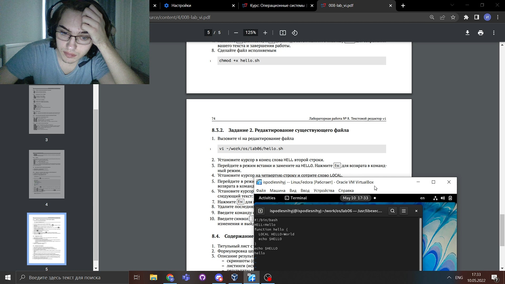

## 3.1 Перейдите в режим вставки и замените на HELLO. Нажмите Esc для возврата в командный режим

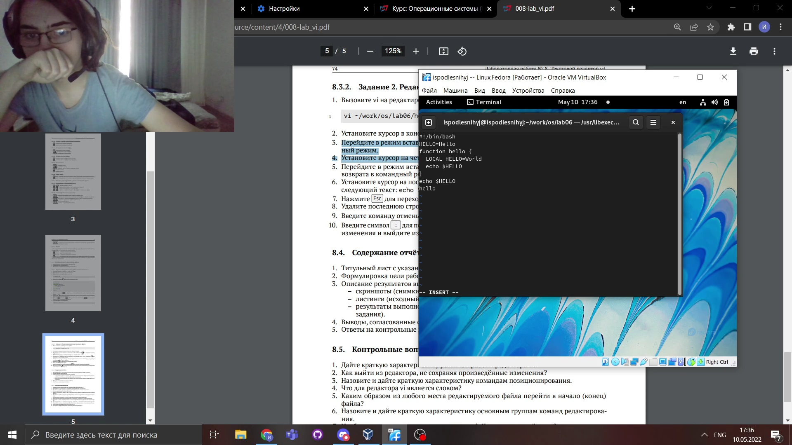

## 4.1 Установите курсор на четвертую строку и сотрите слово LOCAL.

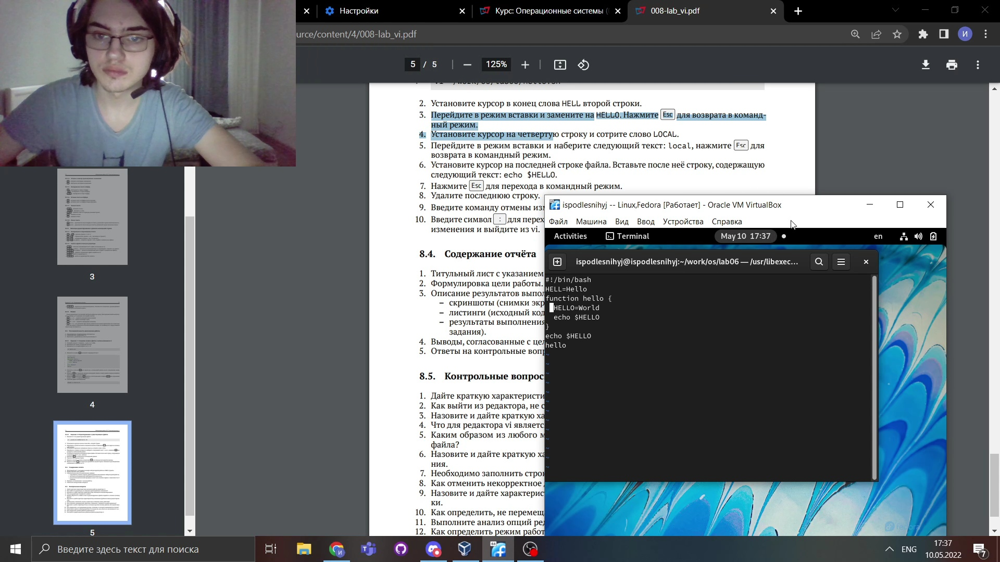

## 5.1 Перейдите в режим вставки и наберите следующий текст: local, нажмите Esc для возврата в командный режим.

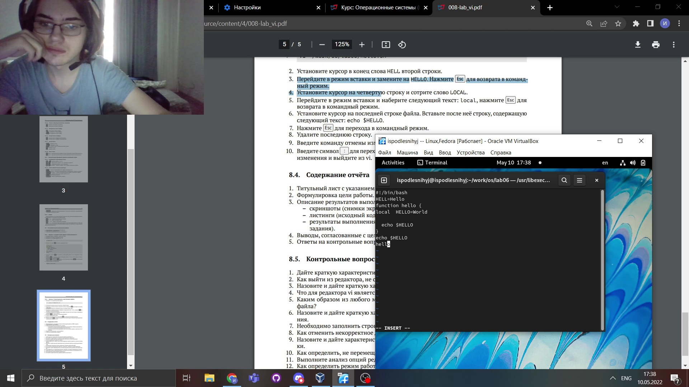

## 6.1 -7.1  Установите курсор на последней строке файла. Вставьте после неё строку, содержащую следующий текст: echo $HELLO и Нажмите Esc для перехода в командный режим

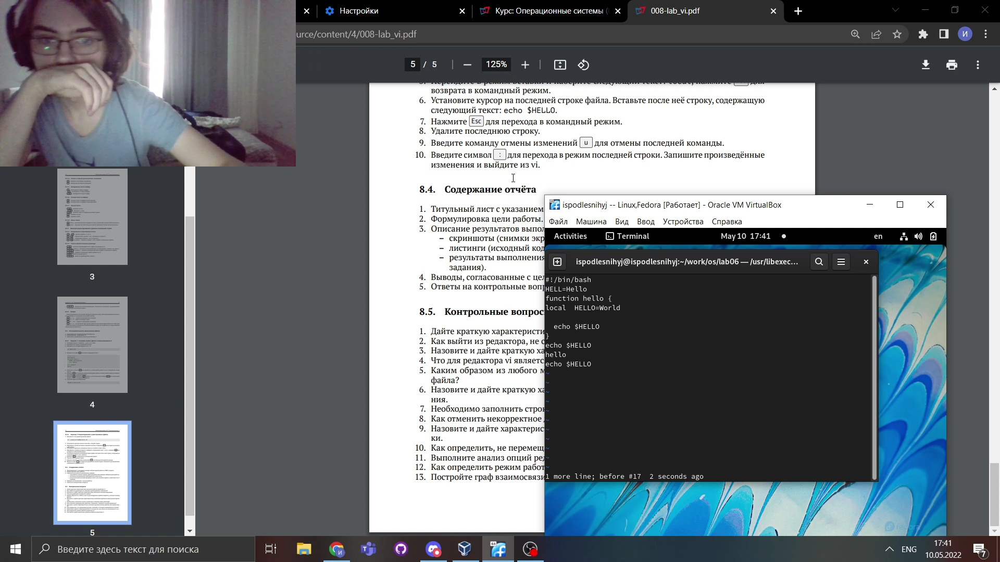

## 8.1 Удалите последнюю строку.

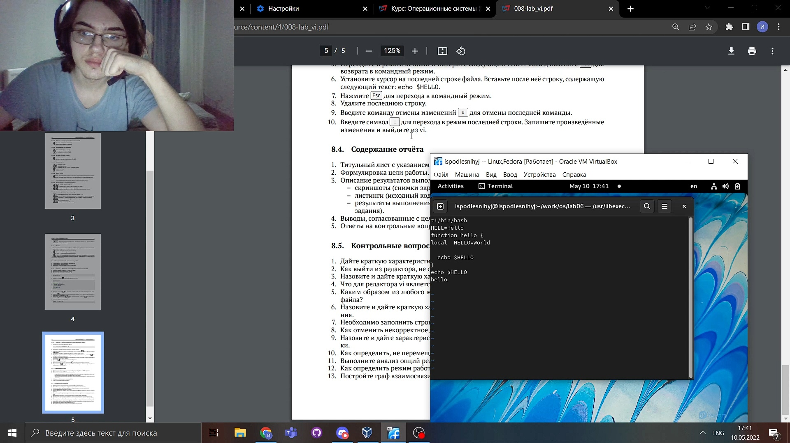

## 9.1 Введите команду отмены изменений u для отмены последней команды.

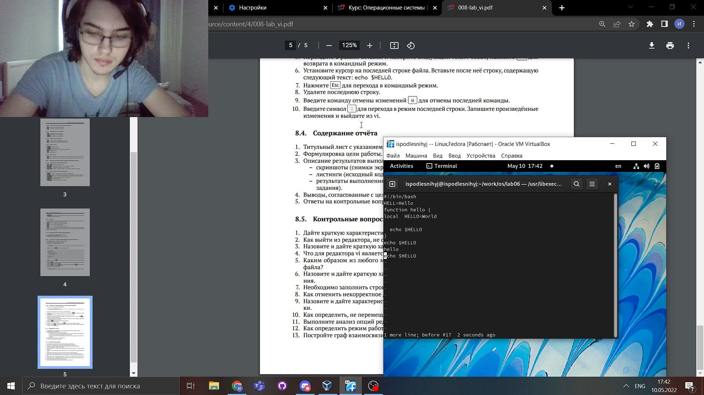

## 10.1 Введите символ : для перехода в режим последней строки. Запишите произведённые изменения и выйдите из vi.

# ВЫВОДЫ

>**Мы Познакомились с операционной системой Linu, получили практические навыки работы с редактором vi, установленным по умолчанию практически во всех дистрибутивах.**
