---
## Front matter
title: "Отчёт по лабораторной работе №8"
subtitle: "НКНбд-01-21"
author: "Подлесный Иван Сергеевич"

## Generic otions
lang: ru-RU
toc-title: "Содержание"

## Bibliography
bibliography: bib/cite.bib
csl: pandoc/csl/gost-r-7-0-5-2008-numeric.csl

## Pdf output format
toc: true # Table of contents
toc-depth: 2
fontsize: 12pt
linestretch: 1.5
papersize: a4
documentclass: scrreprt
## I18n polyglossia
polyglossia-lang:
  name: russian
  options:
	- spelling=modern
	- babelshorthands=true
polyglossia-otherlangs:
  name: english
## I18n babel
babel-lang: russian
babel-otherlangs: english
## Fonts
mainfont: PT Serif
romanfont: PT Serif
sansfont: PT Sans
monofont: PT Mono
mainfontoptions: Ligatures=TeX
romanfontoptions: Ligatures=TeX
sansfontoptions: Ligatures=TeX,Scale=MatchLowercase
monofontoptions: Scale=MatchLowercase,Scale=0.9
## Biblatex
biblatex: true
biblio-style: "gost-numeric"
biblatexoptions:
  - parentracker=true
  - backend=biber
  - hyperref=auto
  - language=auto
  - autolang=other*
  - citestyle=gost-numeric
## Pandoc-crossref LaTeX customization
figureTitle: "Рис."
tableTitle: "Таблица"
listingTitle: "Листинг"
lofTitle: "Цель Работы"
lotTitle: "Ход Работы"
lolTitle: "Листинги"
## Misc options
indent: true
header-includes:
  - \usepackage{indentfirst}
  - \usepackage{float} # keep figures where there are in the text
  - \floatplacement{figure}{H} # keep figures where there are in the text
---

># ЦЕЛЬ РАБОТЫ

>**Познакомиться с операционной системой Linux. Получить практические навыки работы с редактором vi, установленным по умолчанию практически во всех дистрибутивах.**

# Ход работы

1. Шаги 1-2 Создайте каталог с именем ~/work/os/lab06 и перейдите во вновь созданный каталог

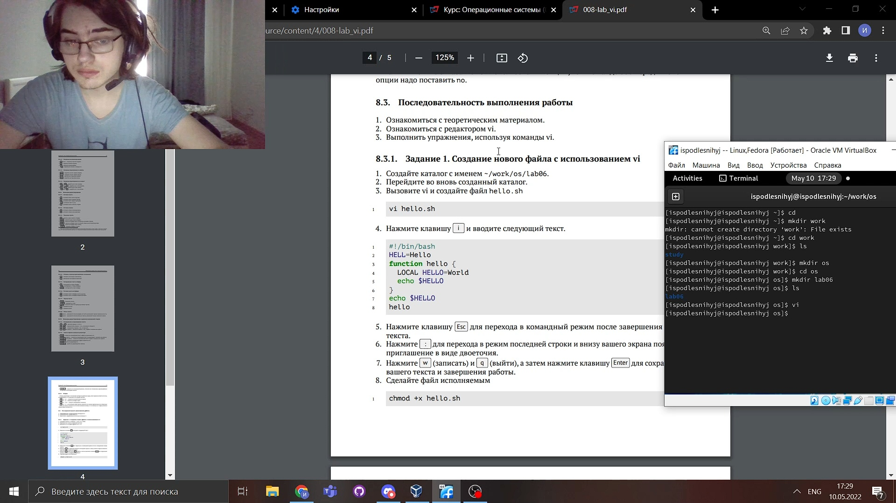

2. Шаги 3-4 вызовите vi и создайте файл hello.sh и Нажмите клавишу i и вводите следующий текст.

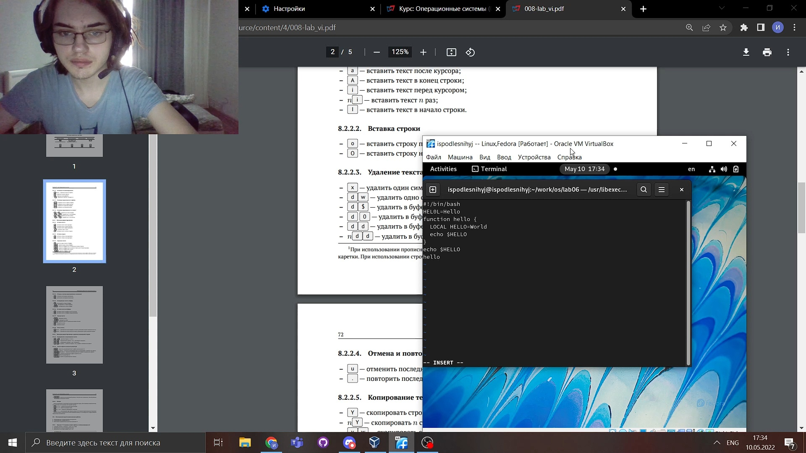

3. Шаги 5-7  Перейдите в командный режим после завершения ввода текста, перейдите в режим последней строки Нажмите w (записать) и q (выйти), а затем нажмите клавишу Enter для сохранения вашего текста и завершения работы.

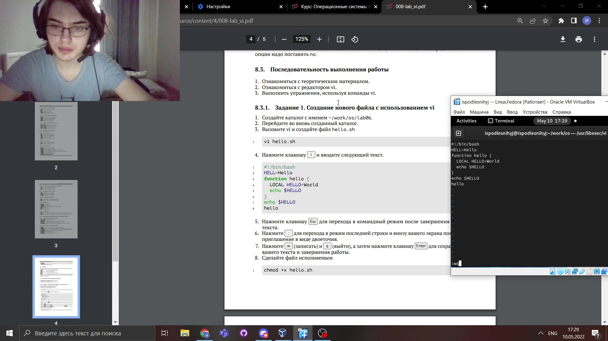

4. Шаг 8 Сделайте файл исполняемым
  
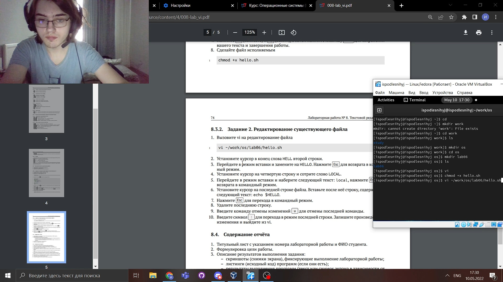

Часть 2

1. Вызовите vi на редактирование файла

2. Установите курсор в конец слова HELL второй строки

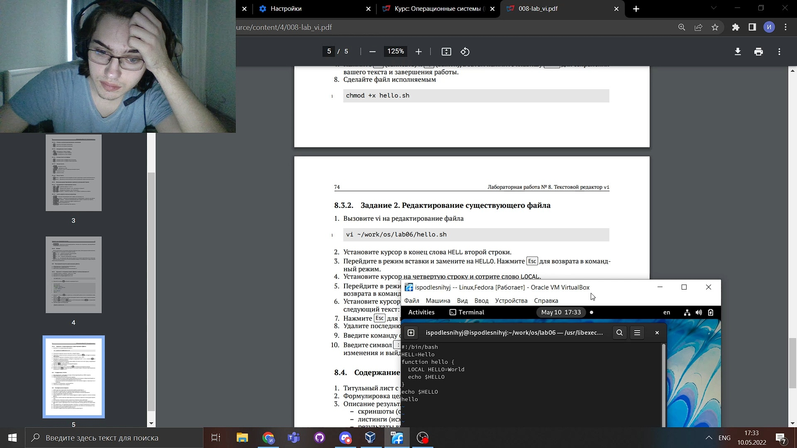

3. Перейдите в режим вставки и замените на HELLO. Нажмите Esc для возврата в командный режим

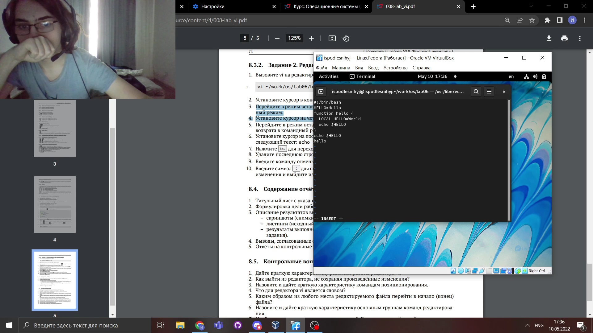

4. Установите курсор на четвертую строку и сотрите слово LOCAL.

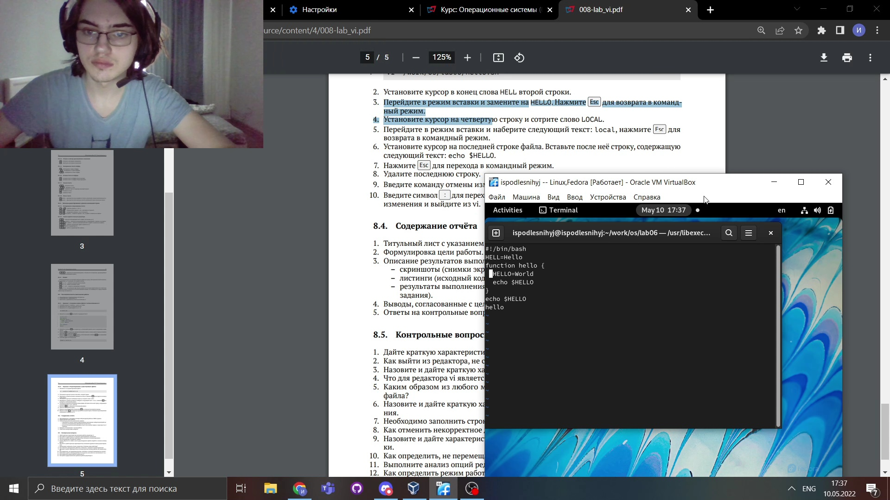

5. Перейдите в режим вставки и наберите следующий текст: local, нажмите Esc для возврата в командный режим.

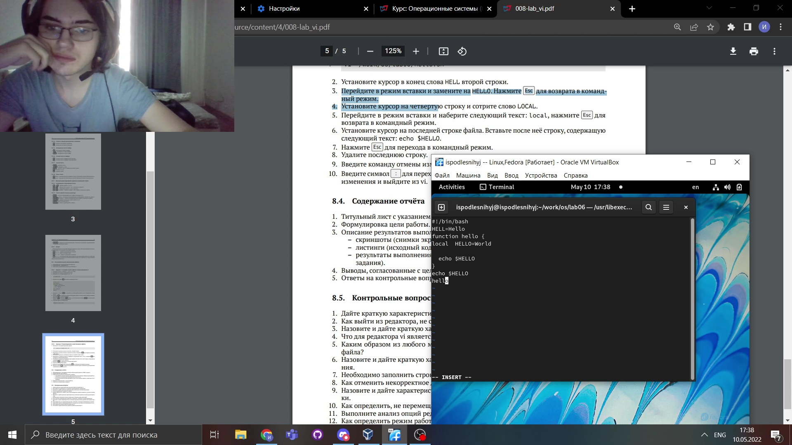

6. Шаги 6-7  Установите курсор на последней строке файла. Вставьте после неё строку, содержащую следующий текст: echo $HELLO и Нажмите Esc для перехода в командный режим

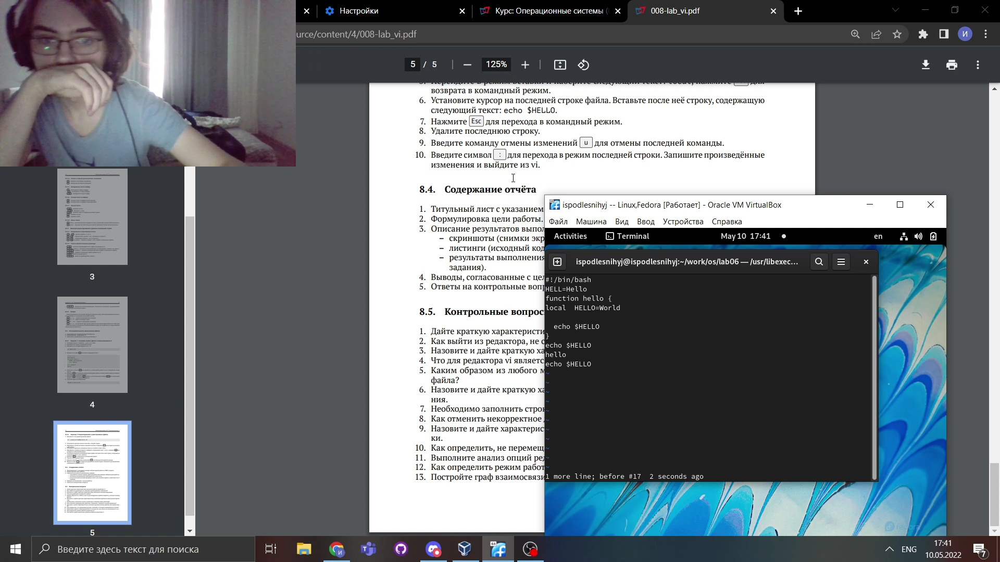

8. Удалите последнюю строку.

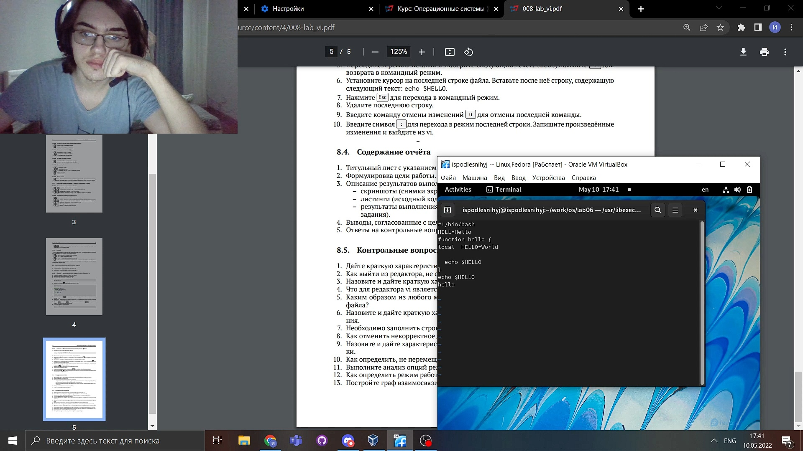

9. Введите команду отмены изменений u для отмены последней команды.

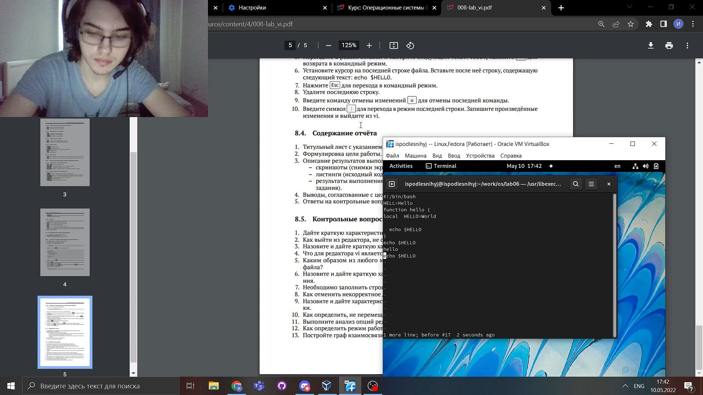

10. Введите символ : для перехода в режим последней строки. Запишите произведённые изменения и выйдите из vi.

# ВЫВОДЫ

>**Мы Познакомились с операционной системой Linu, получили практические навыки работы с редактором vi, установленным по умолчанию практически во всех дистрибутивах.**
