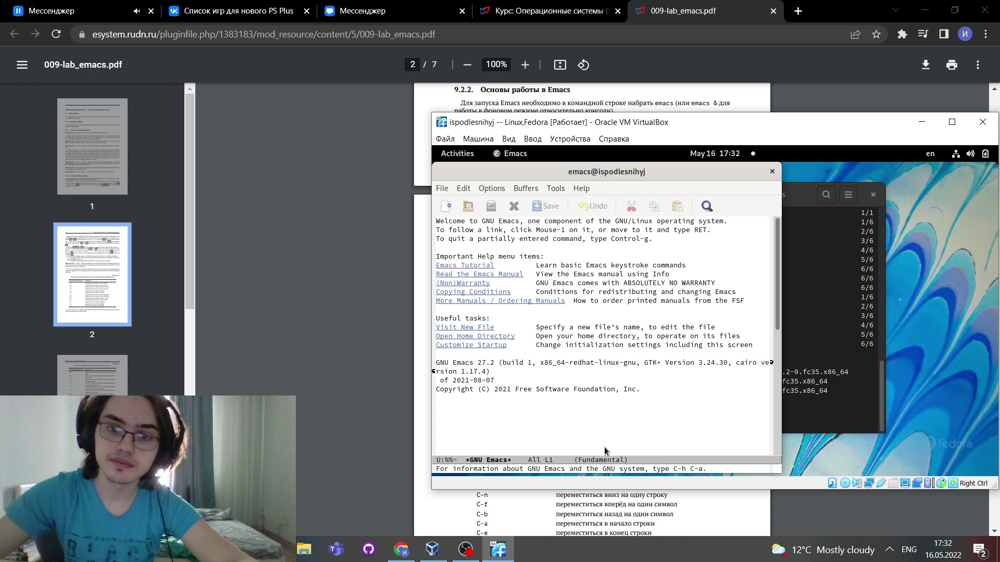
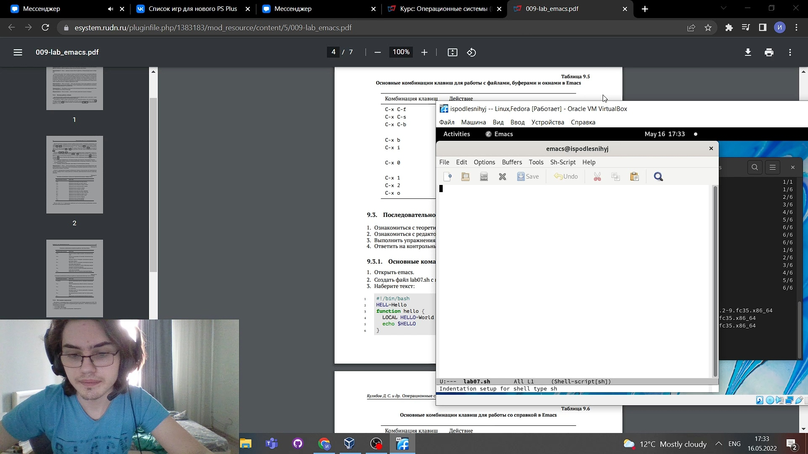
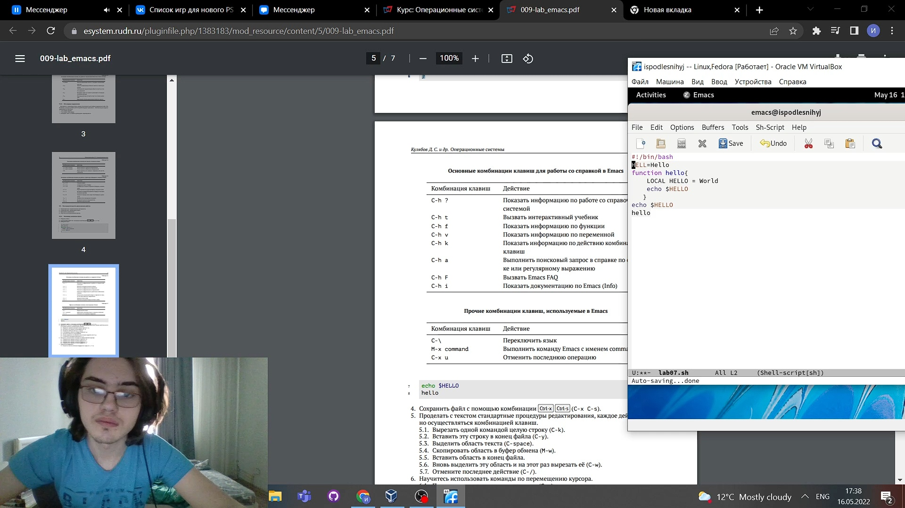
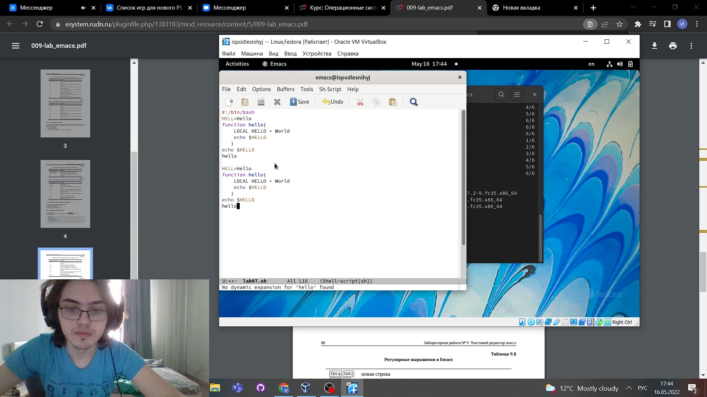
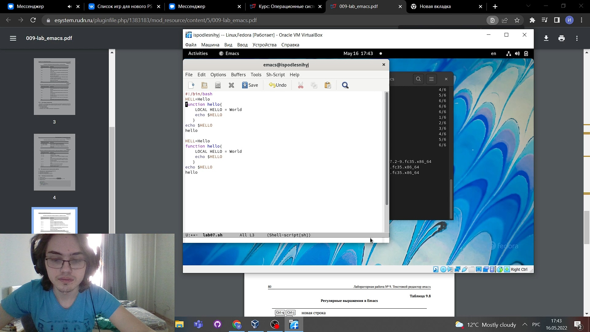
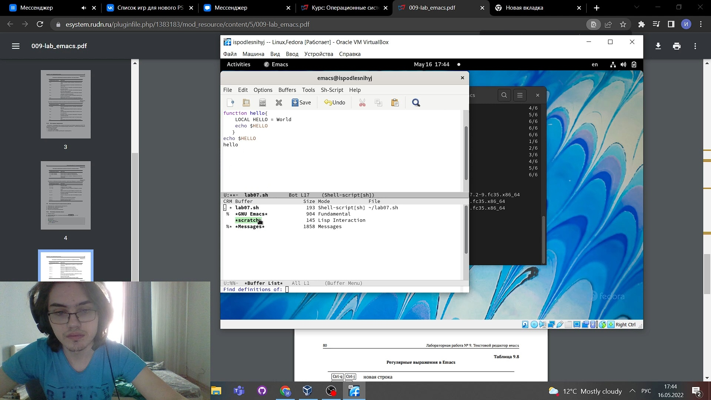
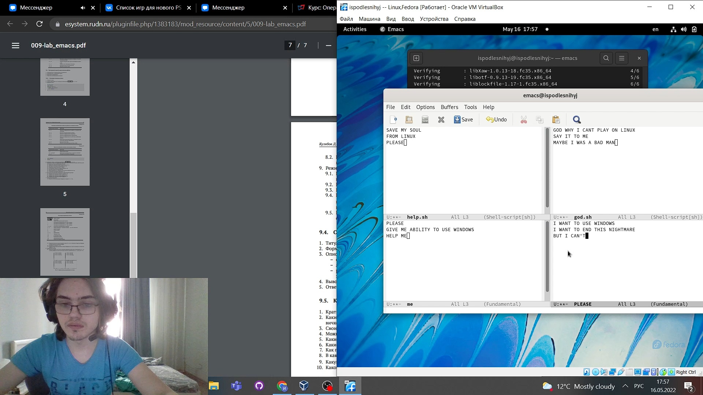
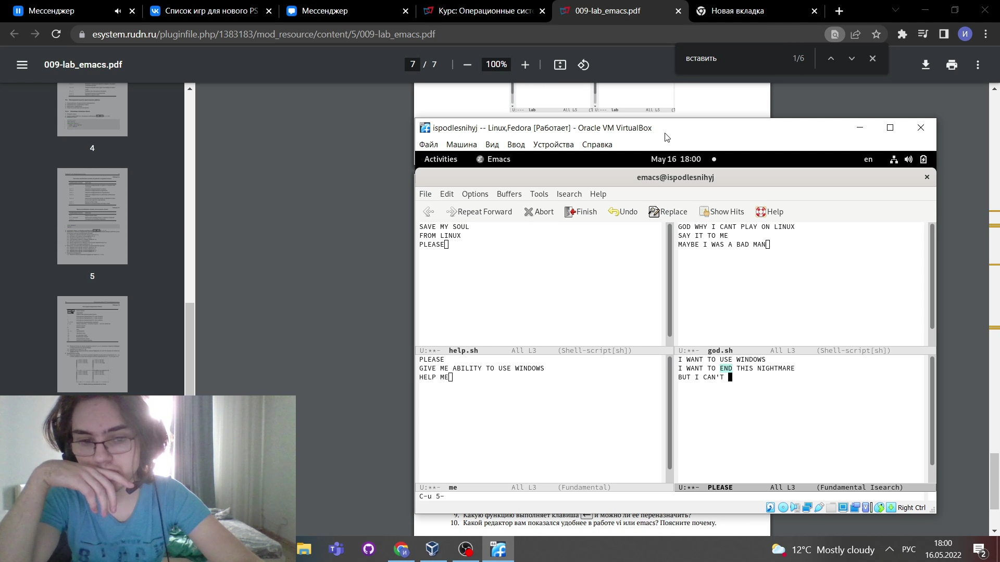

---
## Front matter
title: "Презентация по лабораторной работе №9"
subtitle: "НКНбд-01-21"
author: "Подлесный Иван Сергеевич"

## Generic otions
lang: ru-RU

## Formatting
toc: false
slide_level: 2
theme: metropolis
header-includes: 
 - \metroset{progressbar=frametitle,sectionpage=progressbar,numbering=fraction}
 - '\makeatletter'
 - '\beamer@ignorenonframefalse'
 - '\makeatother'
aspectratio: 43
section-titles: true
---

>
># ЦЕЛЬ РАБОТЫ

>**Познакомиться с операционной системой Linux. Получить практические навыки работы с редактором Emacs**

# Ход работы

## 1 Открыть emacs.

## 2 Создать файл lab07.sh с помощью комбинации Ctrl-x Ctrl-f.

## 3 Наберите заданный текст:

## 4 Сохранить файл с помощью комбинации Ctrl-x Ctrl-s 
  

## 5 Проделать с текстом стандартные процедуры редактирования, каждое действие должно осуществляться комбинацией клавиш

## 6 Научитесь использовать команды по перемещению курсора.

## 7 Изучите управление буферами

## 8 Изучите управление окнами

## 9 Изучите режим поиска

# ВЫВОДЫ

>**Мы Познакомились с операционной системой Linux и Получили практические навыки работы с редактором Emacs**
