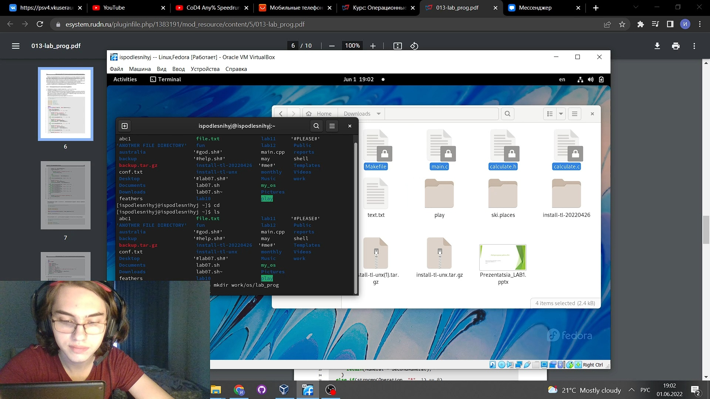
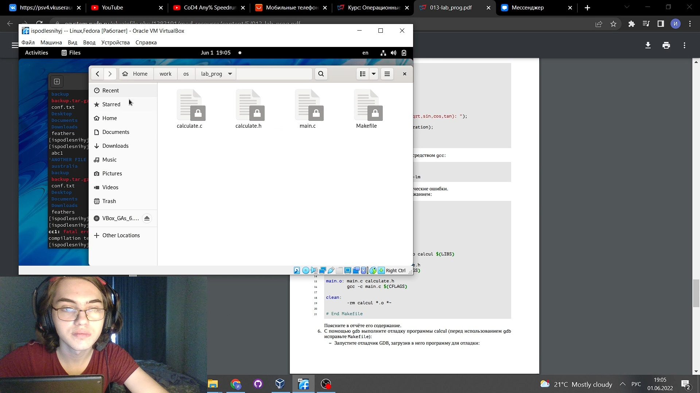
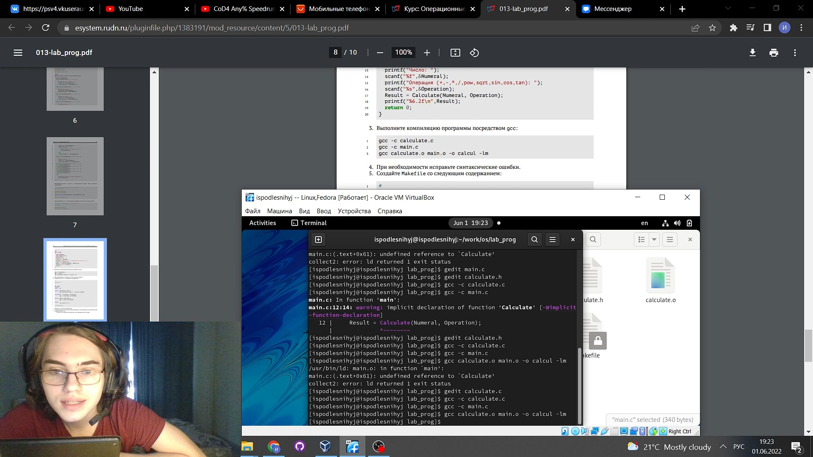
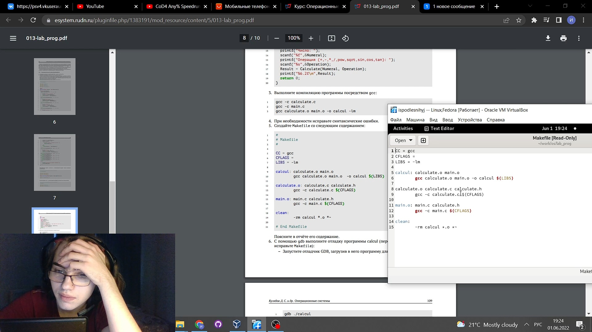
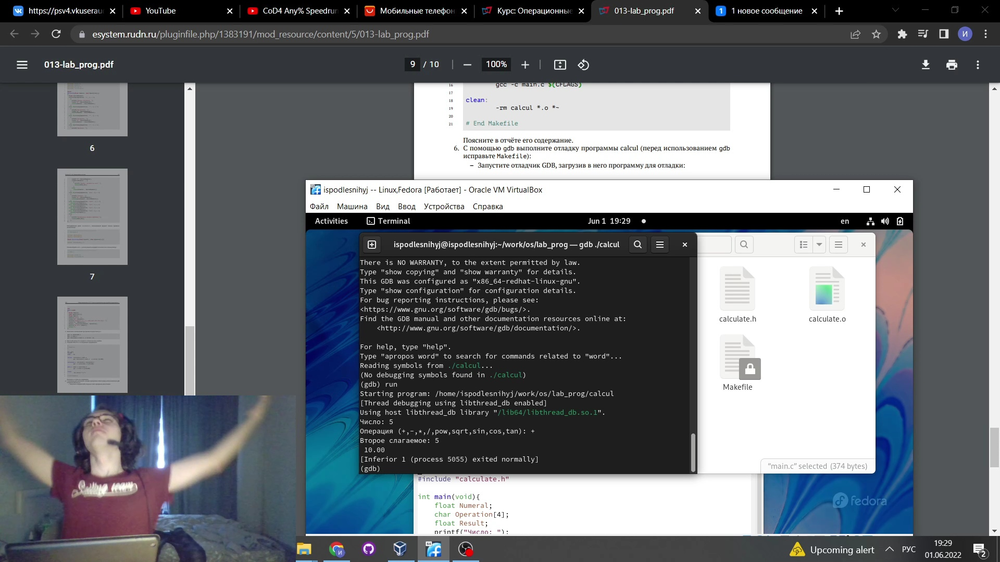
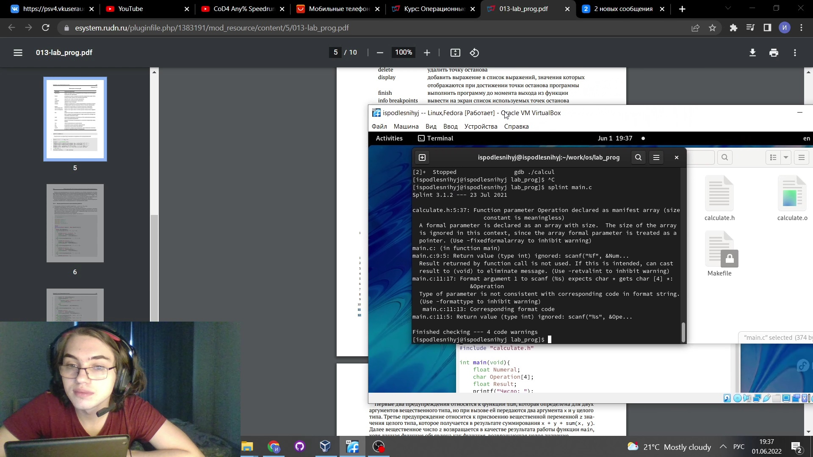

---
## Front matter
title: "Презентация по лабораторной работе №13"
subtitle: "НКНбд-01-21"
author: "Подлесный Иван Сергеевич"

## Generic otions
lang: ru-RU

## Formatting
toc: false
slide_level: 2
theme: metropolis
header-includes: 
 - \metroset{progressbar=frametitle,sectionpage=progressbar,numbering=fraction}
 - '\makeatletter'
 - '\beamer@ignorenonframefalse'
 - '\makeatother'
aspectratio: 43
section-titles: true
---

>
>># ЦЕЛЬ РАБОТЫ

>**Приобрести простейшие навыки разработки, анализа, тестирования и отладки приложений в ОС типа UNIX/Linux на примере создания на языке программирования
"С" калькулятора с простейшими функциями**

# Ход работы

## 1. В домашнем каталоге создайте подкаталог ~/work/os/lab_prog.

## 2. Создайте в нём файлы: calculate.h, calculate.c, main.c. Это будет примитивнейший калькулятор, способный складывать, вычитать, умножать и делить, возводить число в степень, брать квадратный корень, вычислять sin, cos, tan. При запуске он будет запрашивать первое число, операцию, второе число. После этого программа выведет результат и остановится.Реализация функций калькулятора в файле calculate.h

## 3. Выполните компиляцию программы посредством gcc.
  

## 4. при необходимости исправьте синтаксические ошибки.

## 5. Создайте Makefile со следующим содержанием:

## 6. С помощью gdb выполните отладку программы calcul (перед использованием gdb
исправьте Makefile):

## 7. С помощью утилиты splint попробуйте проанализировать коды файлов calculate.c
и main.c.

# ВЫВОДЫ

>**Мы приобрели простейшие навыки разработки, анализа, тестирования и отладки приложений в ОС типа UNIX/Linux на примере создания на языке программирования "С" калькулятора с простейшими функциями**
