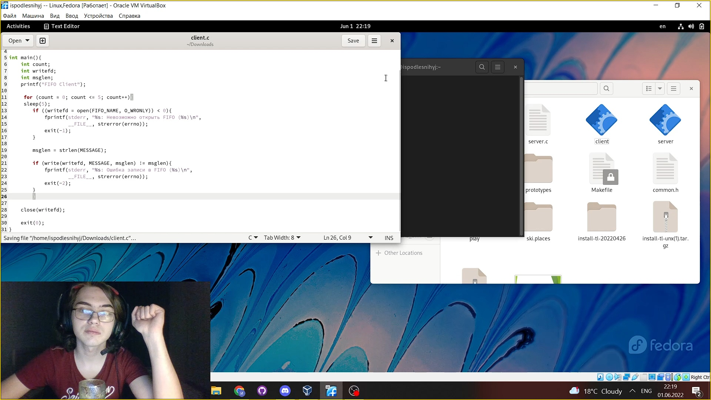
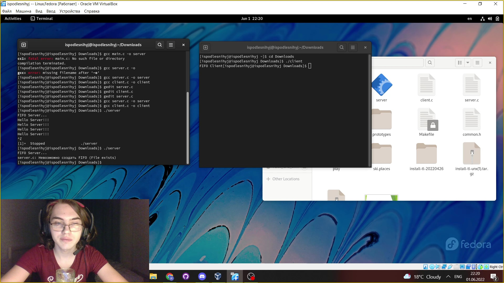

---
## Front matter
title: "Презентация по лабораторной работе №14"
subtitle: "НКНбд-01-21"
author: "Подлесный Иван Сергеевич"

## Generic otions
lang: ru-RU

## Formatting
toc: false
slide_level: 2
theme: metropolis
header-includes: 
 - \metroset{progressbar=frametitle,sectionpage=progressbar,numbering=fraction}
 - '\makeatletter'
 - '\beamer@ignorenonframefalse'
 - '\makeatother'
aspectratio: 43
section-titles: true
---

>
>># ЦЕЛЬ РАБОТЫ

>**Приобретение практических навыков работы с именованными каналами**

# Ход работы

## 1. Работает не 1 клиент, а несколько (например, пять).

## 2. Клиенты передают текущее время с некоторой периодичностью (например, раз в пять секунд). Используйте функцию sleep() для приостановки работы клиента.

## 3. Сервер работает не бесконечно, а прекращает работу через некоторое время (например, 30 сек). Используйте функцию clock() для определения времени работы сервера.Что будет в случае, если сервер завершит работу, не закрыв канал?

# ВЫВОДЫ

>**Мы Приобретели практические навыки работы с именованными каналами**

